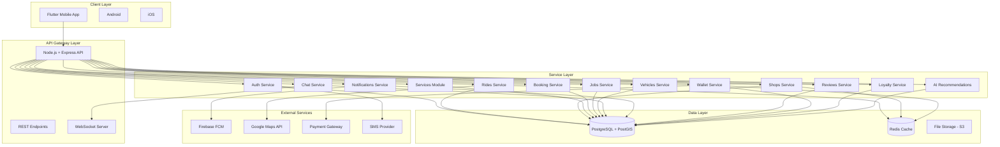
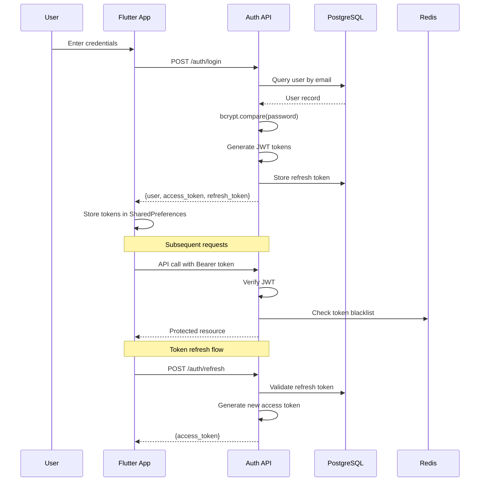
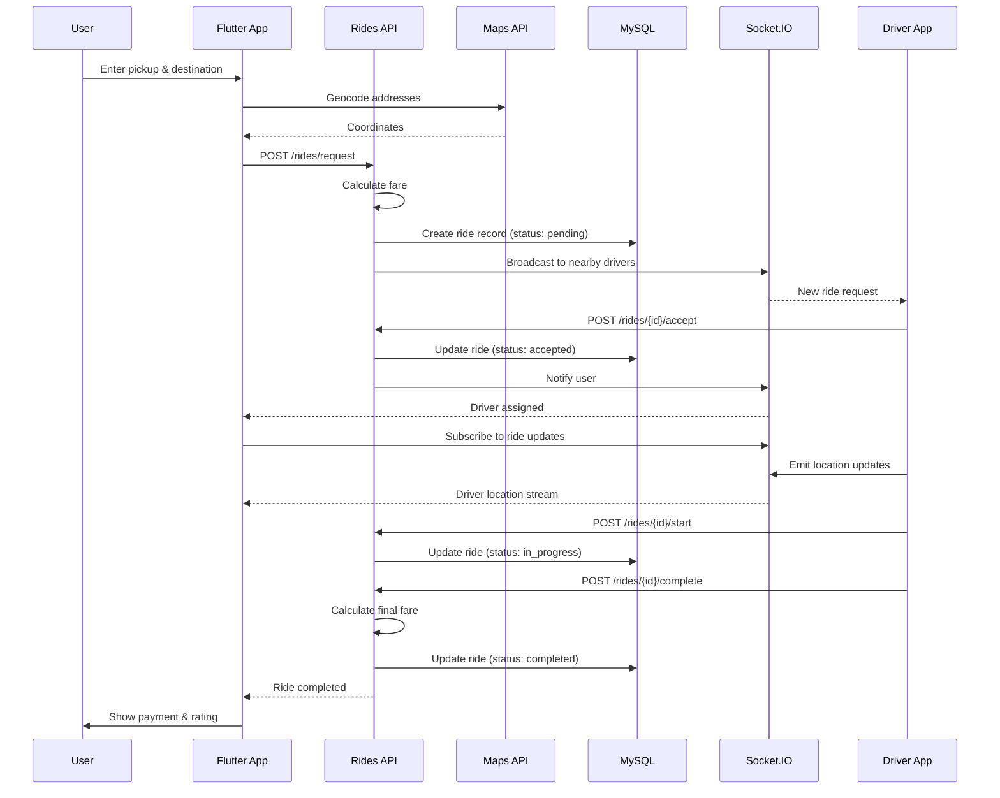
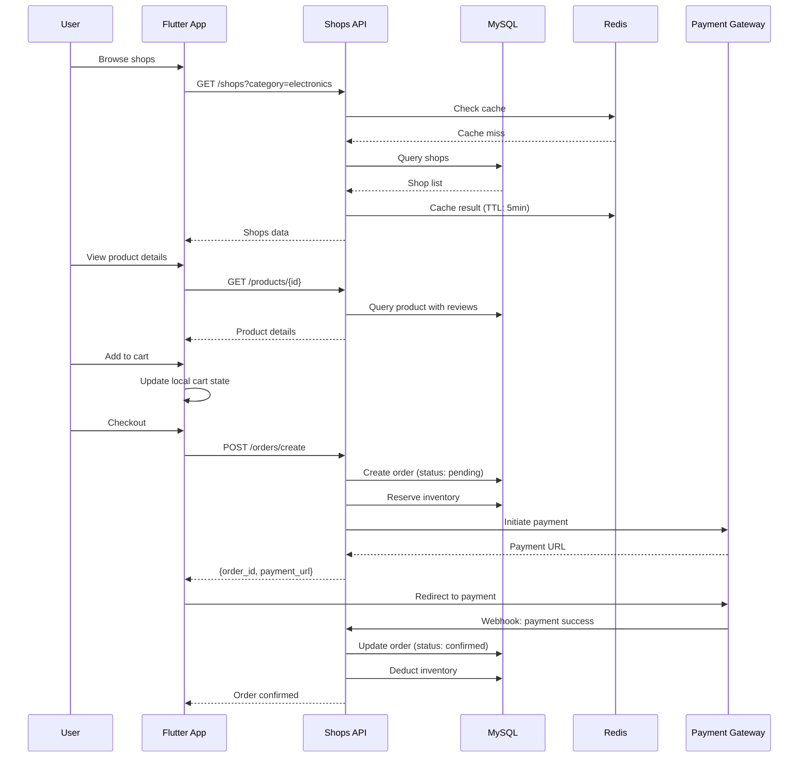
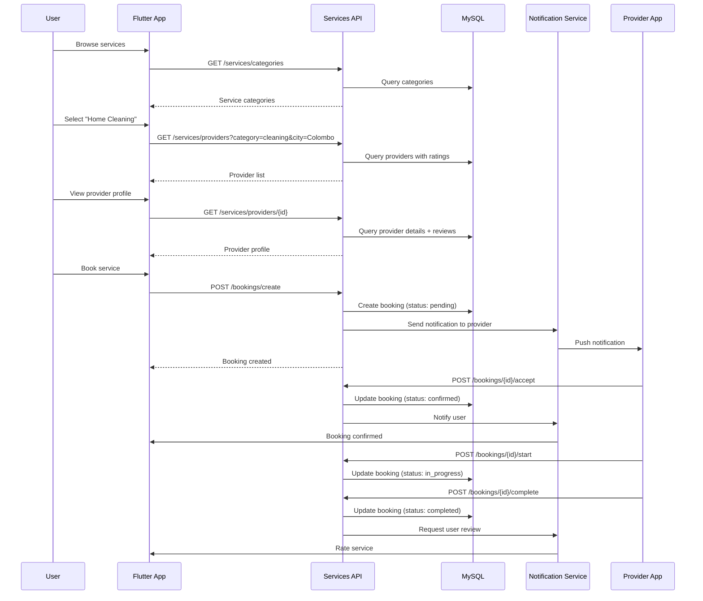
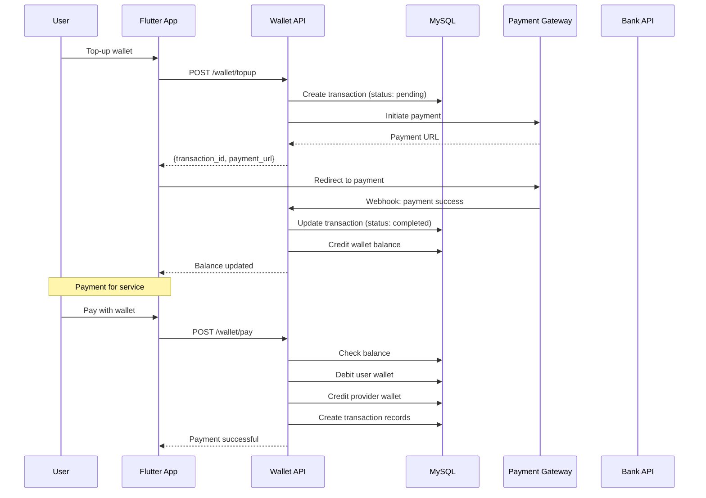
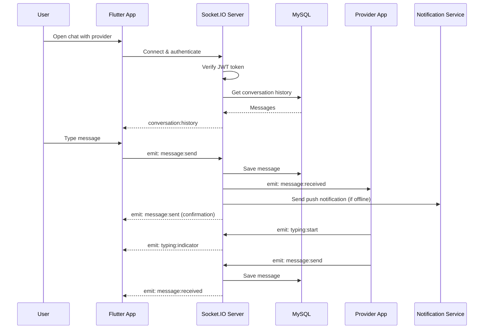
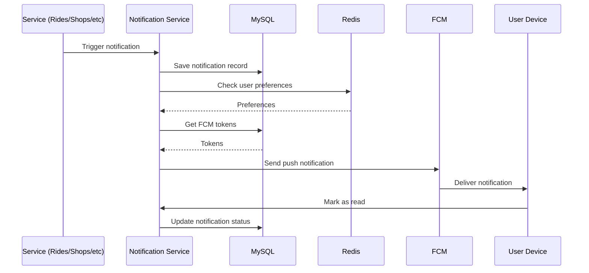
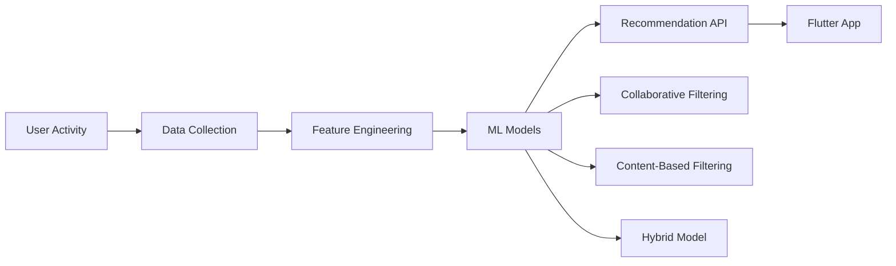

# Design Document: VisaDuma Super App System

## Overview

VisaDuma is a comprehensive super app for Sri Lanka inspired by Gojek, Grab, and Careem. It provides an all-in-one platform for ride-hailing, e-commerce, on-demand services, job marketplace, vehicle rentals, real-time chat, and integrated payments. The system is built on a modular monolith architecture with Flutter frontend (clean architecture + Riverpod) and Node.js + Express + PostgreSQL backend with PostGIS extension, designed for scalability, security (OWASP compliance), and Sri Lankan market context (multilingual support, low-bandwidth optimization).

The design builds upon an existing foundation with JWT authentication, feature-first folder structure, and real-time capabilities via Socket.IO. This document provides both high-level architecture (system diagrams, components, data models) and low-level design (code structure, algorithms, API specifications) for 15 core modules.

## System Architecture

### High-Level Architecture



### Technology Stack

**Frontend (Flutter)**
- State Management: Riverpod (flutter_riverpod, riverpod_annotation)
- Navigation: go_router
- Networking: Dio with interceptors
- Real-time: socket_io_client
- Localization: intl (English, Sinhala, Tamil)
- Functional Programming: dartz
- Code Generation: freezed, json_serializable

**Backend (Node.js)**
- Framework: Express.js
- Database: PostgreSQL with pg/node-postgres
- Geospatial: PostGIS extension for location-based queries
- Caching: Redis (to be added)
- Authentication: JWT with refresh tokens (bcryptjs)
- Real-time: Socket.IO
- File Upload: multer + AWS S3

**Infrastructure**
- Cloud: AWS (EC2, RDS, S3, ElastiCache)
- CDN: CloudFront
- Push Notifications: Firebase Cloud Messaging
- Maps: Google Maps Platform
- CI/CD: GitHub Actions

**Architecture Pattern**
- Frontend: Clean Architecture (data/domain/presentation layers)
- Backend: Modular Monolith with potential microservices split
- Communication: REST + WebSocket
- Data Flow: Unidirectional (Riverpod state management)


## Module 1: Authentication & Authorization (IMPLEMENTED)

### Overview
JWT-based authentication with refresh token rotation. Supports multiple user roles (user, provider, shop_owner, admin) with role-based access control.

### Architecture



### Database Schema

```sql
-- Users table (EXISTING)
CREATE TABLE users (
  id            VARCHAR(36)  PRIMARY KEY DEFAULT (UUID()),
  full_name     VARCHAR(100) NOT NULL,
  email         VARCHAR(150) NOT NULL UNIQUE,
  phone         VARCHAR(20)  NOT NULL DEFAULT '',
  password_hash VARCHAR(255) NOT NULL,
  role          ENUM('user','provider','shop_owner','admin') NOT NULL DEFAULT 'user',
  avatar_url    VARCHAR(500) NULL,
  is_verified   TINYINT(1)   NOT NULL DEFAULT 0,
  created_at    DATETIME     NOT NULL DEFAULT CURRENT_TIMESTAMP,
  updated_at    DATETIME     NOT NULL DEFAULT CURRENT_TIMESTAMP ON UPDATE CURRENT_TIMESTAMP,
  INDEX idx_email (email),
  INDEX idx_phone (phone)
);

-- Refresh tokens table (EXISTING)
CREATE TABLE refresh_tokens (
  id         INT          PRIMARY KEY AUTO_INCREMENT,
  user_id    VARCHAR(36)  NOT NULL,
  token      VARCHAR(512) NOT NULL UNIQUE,
  expires_at DATETIME     NOT NULL,
  created_at DATETIME     NOT NULL DEFAULT CURRENT_TIMESTAMP,
  FOREIGN KEY (user_id) REFERENCES users(id) ON DELETE CASCADE,
  INDEX idx_user_id (user_id),
  INDEX idx_token (token)
);
```

### API Endpoints (EXISTING)

```typescript
// POST /api/v1/auth/register
interface RegisterRequest {
  full_name: string;
  email: string;
  phone: string;
  password: string;
  role?: 'user' | 'provider' | 'shop_owner';
}

interface AuthResponse {
  success: boolean;
  data: {
    user: User;
    access_token: string;
    refresh_token: string;
  };
}

// POST /api/v1/auth/login
interface LoginRequest {
  email: string;
  password: string;
}

// POST /api/v1/auth/refresh
interface RefreshRequest {
  refresh_token: string;
}

// POST /api/v1/auth/logout
// Headers: Authorization: Bearer <access_token>

// GET /api/v1/auth/me
// Headers: Authorization: Bearer <access_token>
```

### Flutter State Management

```dart
// Riverpod provider structure (EXISTING)
@riverpod
class AuthViewModel extends _$AuthViewModel {
  @override
  FutureOr<UserEntity?> build() async {
    // Load cached user from SharedPreferences
    return await _loadCachedUser();
  }

  Future<String?> login(String email, String password) async {
    state = const AsyncLoading();
    final result = await ref.read(authRepositoryProvider).login(email, password);
    return result.fold(
      (failure) {
        state = AsyncError(failure, StackTrace.current);
        return failure.message;
      },
      (user) {
        state = AsyncData(user);
        return null;
      },
    );
  }
}
```

### Security Considerations

- Passwords hashed with bcrypt (cost factor 10)
- JWT access tokens: 15-minute expiry
- Refresh tokens: 7-day expiry with rotation
- Token blacklisting via Redis for logout
- HTTPS only in production
- Rate limiting on auth endpoints (5 attempts per 15 minutes)
- SQL injection prevention via parameterized queries
- XSS protection via input sanitization


## Module 2: Rides (Uber-like Ride-Hailing)

### Overview
Real-time ride-hailing system with driver matching, live tracking, fare calculation, and ride history. Supports multiple vehicle types (bike, tuk-tuk, car, van).

### User Flow



### Database Schema

```sql
CREATE TABLE rides (
  id              VARCHAR(36)  PRIMARY KEY DEFAULT (UUID()),
  user_id         VARCHAR(36)  NOT NULL,
  driver_id       VARCHAR(36)  NULL,
  vehicle_type    ENUM('bike','tuk_tuk','car','van') NOT NULL,
  status          ENUM('pending','accepted','in_progress','completed','cancelled') NOT NULL DEFAULT 'pending',
  pickup_lat      DECIMAL(10,8) NOT NULL,
  pickup_lng      DECIMAL(11,8) NOT NULL,
  pickup_address  VARCHAR(500) NOT NULL,
  dropoff_lat     DECIMAL(10,8) NOT NULL,
  dropoff_lng     DECIMAL(11,8) NOT NULL,
  dropoff_address VARCHAR(500) NOT NULL,
  distance_km     DECIMAL(6,2) NULL,
  duration_min    INT NULL,
  estimated_fare  DECIMAL(10,2) NOT NULL,
  final_fare      DECIMAL(10,2) NULL,
  payment_method  ENUM('cash','wallet','card') NOT NULL DEFAULT 'cash',
  payment_status  ENUM('pending','completed','failed') NOT NULL DEFAULT 'pending',
  notes           TEXT NULL,
  created_at      DATETIME NOT NULL DEFAULT CURRENT_TIMESTAMP,
  started_at      DATETIME NULL,
  completed_at    DATETIME NULL,
  cancelled_at    DATETIME NULL,
  FOREIGN KEY (user_id) REFERENCES users(id),
  FOREIGN KEY (driver_id) REFERENCES users(id),
  INDEX idx_user_id (user_id),
  INDEX idx_driver_id (driver_id),
  INDEX idx_status (status),
  INDEX idx_created_at (created_at)
);

CREATE TABLE drivers (
  id              VARCHAR(36) PRIMARY KEY,
  user_id         VARCHAR(36) NOT NULL UNIQUE,
  vehicle_type    ENUM('bike','tuk_tuk','car','van') NOT NULL,
  vehicle_number  VARCHAR(20) NOT NULL,
  license_number  VARCHAR(50) NOT NULL,
  is_available    TINYINT(1) NOT NULL DEFAULT 0,
  current_lat     DECIMAL(10,8) NULL,
  current_lng     DECIMAL(11,8) NULL,
  rating          DECIMAL(3,2) NOT NULL DEFAULT 5.00,
  total_rides     INT NOT NULL DEFAULT 0,
  created_at      DATETIME NOT NULL DEFAULT CURRENT_TIMESTAMP,
  FOREIGN KEY (user_id) REFERENCES users(id) ON DELETE CASCADE,
  INDEX idx_available (is_available),
  SPATIAL INDEX idx_location (current_lat, current_lng)
);

CREATE TABLE ride_locations (
  id         INT PRIMARY KEY AUTO_INCREMENT,
  ride_id    VARCHAR(36) NOT NULL,
  lat        DECIMAL(10,8) NOT NULL,
  lng        DECIMAL(11,8) NOT NULL,
  timestamp  DATETIME NOT NULL DEFAULT CURRENT_TIMESTAMP,
  FOREIGN KEY (ride_id) REFERENCES rides(id) ON DELETE CASCADE,
  INDEX idx_ride_id (ride_id)
);
```

### API Endpoints

```typescript
// POST /api/v1/rides/request
interface RideRequestPayload {
  vehicle_type: 'bike' | 'tuk_tuk' | 'car' | 'van';
  pickup_lat: number;
  pickup_lng: number;
  pickup_address: string;
  dropoff_lat: number;
  dropoff_lng: number;
  dropoff_address: string;
  payment_method: 'cash' | 'wallet' | 'card';
  notes?: string;
}

interface RideResponse {
  success: boolean;
  data: {
    ride: Ride;
    estimated_fare: number;
    estimated_duration: number;
  };
}

// GET /api/v1/rides/history?page=1&limit=20
// GET /api/v1/rides/{id}
// POST /api/v1/rides/{id}/cancel
// POST /api/v1/rides/{id}/accept (driver only)
// POST /api/v1/rides/{id}/start (driver only)
// POST /api/v1/rides/{id}/complete (driver only)

// Driver endpoints
// GET /api/v1/drivers/nearby?lat=6.9271&lng=79.8612&radius=5
// PUT /api/v1/drivers/availability
// PUT /api/v1/drivers/location
```

### Fare Calculation Algorithm

```typescript
interface FareCalculationInput {
  distance_km: number;
  duration_min: number;
  vehicle_type: 'bike' | 'tuk_tuk' | 'car' | 'van';
  surge_multiplier?: number;
}

function calculateFare(input: FareCalculationInput): number {
  // Base fares (LKR)
  const baseFares = {
    bike: 50,
    tuk_tuk: 100,
    car: 150,
    van: 200
  };
  
  // Per km rates (LKR)
  const perKmRates = {
    bike: 30,
    tuk_tuk: 50,
    car: 80,
    van: 100
  };
  
  // Per minute rates (LKR)
  const perMinRates = {
    bike: 2,
    tuk_tuk: 3,
    car: 5,
    van: 7
  };
  
  const baseFare = baseFares[input.vehicle_type];
  const distanceFare = input.distance_km * perKmRates[input.vehicle_type];
  const timeFare = input.duration_min * perMinRates[input.vehicle_type];
  const surgeMultiplier = input.surge_multiplier || 1.0;
  
  const totalFare = (baseFare + distanceFare + timeFare) * surgeMultiplier;
  
  // Round to nearest 10 LKR
  return Math.round(totalFare / 10) * 10;
}
```

### Driver Matching Algorithm

```typescript
interface DriverMatchingInput {
  pickup_lat: number;
  pickup_lng: number;
  vehicle_type: string;
  max_radius_km: number;
}

async function findNearbyDrivers(input: DriverMatchingInput): Promise<Driver[]> {
  // Haversine formula for distance calculation
  const query = `
    SELECT d.*, u.full_name, u.phone, u.avatar_url,
      (6371 * acos(
        cos(radians(?)) * cos(radians(d.current_lat)) *
        cos(radians(d.current_lng) - radians(?)) +
        sin(radians(?)) * sin(radians(d.current_lat))
      )) AS distance_km
    FROM drivers d
    JOIN users u ON d.user_id = u.id
    WHERE d.is_available = 1
      AND d.vehicle_type = ?
      AND d.current_lat IS NOT NULL
      AND d.current_lng IS NOT NULL
    HAVING distance_km <= ?
    ORDER BY distance_km ASC, d.rating DESC
    LIMIT 10
  `;
  
  const [drivers] = await db.execute(query, [
    input.pickup_lat,
    input.pickup_lng,
    input.pickup_lat,
    input.vehicle_type,
    input.max_radius_km
  ]);
  
  return drivers;
}
```

### Socket.IO Events

```typescript
// Client → Server
socket.emit('ride:request', { ride_id, pickup_location, dropoff_location });
socket.emit('driver:location_update', { lat, lng });
socket.emit('ride:cancel', { ride_id });

// Server → Client
socket.on('ride:driver_assigned', (data) => {
  // { ride_id, driver: { id, name, phone, vehicle, location } }
});

socket.on('ride:location_update', (data) => {
  // { ride_id, driver_location: { lat, lng }, eta_minutes }
});

socket.on('ride:status_changed', (data) => {
  // { ride_id, status: 'accepted' | 'in_progress' | 'completed' }
});
```

### Flutter State Management

```dart
@riverpod
class RidesViewModel extends _$RidesViewModel {
  @override
  FutureOr<List<Ride>> build() async {
    return await ref.read(ridesRepositoryProvider).getRideHistory();
  }

  Future<Either<Failure, Ride>> requestRide(RideRequest request) async {
    state = const AsyncLoading();
    final result = await ref.read(ridesRepositoryProvider).requestRide(request);
    
    return result.fold(
      (failure) {
        state = AsyncError(failure, StackTrace.current);
        return Left(failure);
      },
      (ride) {
        // Subscribe to real-time updates
        ref.read(socketServiceProvider).subscribeToRide(ride.id);
        return Right(ride);
      },
    );
  }
}

// Real-time location tracking provider
@riverpod
Stream<DriverLocation> driverLocationStream(Ref ref, String rideId) {
  final socket = ref.read(socketServiceProvider);
  return socket.on('ride:location_update')
    .where((data) => data['ride_id'] == rideId)
    .map((data) => DriverLocation.fromJson(data['driver_location']));
}
```

### Performance Optimizations

- Redis caching for active rides and driver locations
- Geospatial indexing for fast driver lookup
- WebSocket connection pooling
- Location updates throttled to 5-second intervals
- Lazy loading of ride history with pagination

### Security Considerations

- Driver verification (license, vehicle documents)
- Real-time location encryption
- Ride cancellation policies
- Emergency SOS button with location sharing
- Driver background checks
- Rate limiting on ride requests (max 3 pending rides)


## Module 3: Shops (E-commerce Marketplace)

### Overview
Multi-vendor e-commerce platform allowing shop owners to list products, manage inventory, and process orders. Users can browse, search, add to cart, and checkout with integrated payment.

### User Flow



### Database Schema

```sql
CREATE TABLE shops (
  id              VARCHAR(36) PRIMARY KEY DEFAULT (UUID()),
  owner_id        VARCHAR(36) NOT NULL,
  name            VARCHAR(200) NOT NULL,
  description     TEXT NULL,
  category        VARCHAR(100) NOT NULL,
  logo_url        VARCHAR(500) NULL,
  banner_url      VARCHAR(500) NULL,
  address         VARCHAR(500) NOT NULL,
  city            VARCHAR(100) NOT NULL,
  phone           VARCHAR(20) NOT NULL,
  email           VARCHAR(150) NULL,
  is_verified     TINYINT(1) NOT NULL DEFAULT 0,
  is_active       TINYINT(1) NOT NULL DEFAULT 1,
  rating          DECIMAL(3,2) NOT NULL DEFAULT 5.00,
  total_orders    INT NOT NULL DEFAULT 0,
  created_at      DATETIME NOT NULL DEFAULT CURRENT_TIMESTAMP,
  updated_at      DATETIME NOT NULL DEFAULT CURRENT_TIMESTAMP ON UPDATE CURRENT_TIMESTAMP,
  FOREIGN KEY (owner_id) REFERENCES users(id),
  INDEX idx_owner_id (owner_id),
  INDEX idx_category (category),
  INDEX idx_city (city),
  FULLTEXT idx_name_desc (name, description)
);

CREATE TABLE products (
  id              VARCHAR(36) PRIMARY KEY DEFAULT (UUID()),
  shop_id         VARCHAR(36) NOT NULL,
  name            VARCHAR(300) NOT NULL,
  description     TEXT NULL,
  category        VARCHAR(100) NOT NULL,
  price           DECIMAL(10,2) NOT NULL,
  discount_price  DECIMAL(10,2) NULL,
  stock_quantity  INT NOT NULL DEFAULT 0,
  sku             VARCHAR(100) NULL,
  images          JSON NULL, -- Array of image URLs
  specifications  JSON NULL, -- Key-value pairs
  is_active       TINYINT(1) NOT NULL DEFAULT 1,
  rating          DECIMAL(3,2) NOT NULL DEFAULT 5.00,
  total_reviews   INT NOT NULL DEFAULT 0,
  total_sold      INT NOT NULL DEFAULT 0,
  created_at      DATETIME NOT NULL DEFAULT CURRENT_TIMESTAMP,
  updated_at      DATETIME NOT NULL DEFAULT CURRENT_TIMESTAMP ON UPDATE CURRENT_TIMESTAMP,
  FOREIGN KEY (shop_id) REFERENCES shops(id) ON DELETE CASCADE,
  INDEX idx_shop_id (shop_id),
  INDEX idx_category (category),
  INDEX idx_price (price),
  INDEX idx_stock (stock_quantity),
  FULLTEXT idx_name_desc (name, description)
);

CREATE TABLE orders (
  id              VARCHAR(36) PRIMARY KEY DEFAULT (UUID()),
  user_id         VARCHAR(36) NOT NULL,
  shop_id         VARCHAR(36) NOT NULL,
  order_number    VARCHAR(50) NOT NULL UNIQUE,
  status          ENUM('pending','confirmed','processing','shipped','delivered','cancelled','refunded') NOT NULL DEFAULT 'pending',
  subtotal        DECIMAL(10,2) NOT NULL,
  delivery_fee    DECIMAL(10,2) NOT NULL DEFAULT 0,
  discount        DECIMAL(10,2) NOT NULL DEFAULT 0,
  total_amount    DECIMAL(10,2) NOT NULL,
  payment_method  ENUM('cash_on_delivery','wallet','card','bank_transfer') NOT NULL,
  payment_status  ENUM('pending','completed','failed','refunded') NOT NULL DEFAULT 'pending',
  delivery_address TEXT NOT NULL,
  delivery_phone  VARCHAR(20) NOT NULL,
  notes           TEXT NULL,
  created_at      DATETIME NOT NULL DEFAULT CURRENT_TIMESTAMP,
  confirmed_at    DATETIME NULL,
  shipped_at      DATETIME NULL,
  delivered_at    DATETIME NULL,
  cancelled_at    DATETIME NULL,
  FOREIGN KEY (user_id) REFERENCES users(id),
  FOREIGN KEY (shop_id) REFERENCES shops(id),
  INDEX idx_user_id (user_id),
  INDEX idx_shop_id (shop_id),
  INDEX idx_status (status),
  INDEX idx_order_number (order_number),
  INDEX idx_created_at (created_at)
);

CREATE TABLE order_items (
  id              INT PRIMARY KEY AUTO_INCREMENT,
  order_id        VARCHAR(36) NOT NULL,
  product_id      VARCHAR(36) NOT NULL,
  product_name    VARCHAR(300) NOT NULL,
  product_image   VARCHAR(500) NULL,
  quantity        INT NOT NULL,
  unit_price      DECIMAL(10,2) NOT NULL,
  total_price     DECIMAL(10,2) NOT NULL,
  FOREIGN KEY (order_id) REFERENCES orders(id) ON DELETE CASCADE,
  FOREIGN KEY (product_id) REFERENCES products(id),
  INDEX idx_order_id (order_id),
  INDEX idx_product_id (product_id)
);

CREATE TABLE cart_items (
  id              INT PRIMARY KEY AUTO_INCREMENT,
  user_id         VARCHAR(36) NOT NULL,
  product_id      VARCHAR(36) NOT NULL,
  quantity        INT NOT NULL DEFAULT 1,
  created_at      DATETIME NOT NULL DEFAULT CURRENT_TIMESTAMP,
  updated_at      DATETIME NOT NULL DEFAULT CURRENT_TIMESTAMP ON UPDATE CURRENT_TIMESTAMP,
  FOREIGN KEY (user_id) REFERENCES users(id) ON DELETE CASCADE,
  FOREIGN KEY (product_id) REFERENCES products(id) ON DELETE CASCADE,
  UNIQUE KEY unique_user_product (user_id, product_id),
  INDEX idx_user_id (user_id)
);
```

### API Endpoints

```typescript
// Shops
// GET /api/v1/shops?category=electronics&city=Colombo&page=1&limit=20
// GET /api/v1/shops/{id}
// POST /api/v1/shops (shop owner only)
// PUT /api/v1/shops/{id} (shop owner only)
// DELETE /api/v1/shops/{id} (shop owner only)

// Products
// GET /api/v1/products?shop_id=xxx&category=phones&min_price=1000&max_price=50000&page=1
// GET /api/v1/products/{id}
// GET /api/v1/products/search?q=samsung+galaxy
// POST /api/v1/products (shop owner only)
// PUT /api/v1/products/{id} (shop owner only)
// DELETE /api/v1/products/{id} (shop owner only)

// Cart
// GET /api/v1/cart
// POST /api/v1/cart/add
interface AddToCartPayload {
  product_id: string;
  quantity: number;
}

// PUT /api/v1/cart/update
interface UpdateCartPayload {
  product_id: string;
  quantity: number;
}

// DELETE /api/v1/cart/remove/{product_id}
// DELETE /api/v1/cart/clear

// Orders
// POST /api/v1/orders/create
interface CreateOrderPayload {
  shop_id: string;
  items: Array<{
    product_id: string;
    quantity: number;
  }>;
  delivery_address: string;
  delivery_phone: string;
  payment_method: 'cash_on_delivery' | 'wallet' | 'card';
  notes?: string;
}

// GET /api/v1/orders?status=confirmed&page=1
// GET /api/v1/orders/{id}
// POST /api/v1/orders/{id}/cancel
// PUT /api/v1/orders/{id}/status (shop owner only)
```

### Search Algorithm with Relevance Scoring

```typescript
interface ProductSearchInput {
  query: string;
  category?: string;
  min_price?: number;
  max_price?: number;
  shop_id?: string;
  sort_by?: 'relevance' | 'price_asc' | 'price_desc' | 'rating' | 'popular';
  page: number;
  limit: number;
}

async function searchProducts(input: ProductSearchInput): Promise<Product[]> {
  // Full-text search with relevance scoring
  let query = `
    SELECT p.*, s.name as shop_name, s.city,
      MATCH(p.name, p.description) AGAINST(? IN NATURAL LANGUAGE MODE) AS relevance_score
    FROM products p
    JOIN shops s ON p.shop_id = s.id
    WHERE p.is_active = 1
      AND s.is_active = 1
      AND MATCH(p.name, p.description) AGAINST(? IN NATURAL LANGUAGE MODE)
  `;
  
  const params: any[] = [input.query, input.query];
  
  if (input.category) {
    query += ` AND p.category = ?`;
    params.push(input.category);
  }
  
  if (input.min_price) {
    query += ` AND p.price >= ?`;
    params.push(input.min_price);
  }
  
  if (input.max_price) {
    query += ` AND p.price <= ?`;
    params.push(input.max_price);
  }
  
  if (input.shop_id) {
    query += ` AND p.shop_id = ?`;
    params.push(input.shop_id);
  }
  
  // Sorting
  switch (input.sort_by) {
    case 'price_asc':
      query += ` ORDER BY p.price ASC`;
      break;
    case 'price_desc':
      query += ` ORDER BY p.price DESC`;
      break;
    case 'rating':
      query += ` ORDER BY p.rating DESC, p.total_reviews DESC`;
      break;
    case 'popular':
      query += ` ORDER BY p.total_sold DESC`;
      break;
    default:
      query += ` ORDER BY relevance_score DESC, p.rating DESC`;
  }
  
  const offset = (input.page - 1) * input.limit;
  query += ` LIMIT ? OFFSET ?`;
  params.push(input.limit, offset);
  
  const [products] = await db.execute(query, params);
  return products;
}
```

### Inventory Management Algorithm

```typescript
interface InventoryReservation {
  product_id: string;
  quantity: number;
  order_id: string;
}

async function reserveInventory(items: InventoryReservation[]): Promise<boolean> {
  const connection = await db.getConnection();
  
  try {
    await connection.beginTransaction();
    
    for (const item of items) {
      // Check current stock with row lock
      const [rows] = await connection.execute(
        'SELECT stock_quantity FROM products WHERE id = ? FOR UPDATE',
        [item.product_id]
      );
      
      const product = rows[0];
      
      if (!product || product.stock_quantity < item.quantity) {
        throw new Error(`Insufficient stock for product ${item.product_id}`);
      }
      
      // Reserve inventory (don't deduct yet)
      await connection.execute(
        'INSERT INTO inventory_reservations (product_id, order_id, quantity, expires_at) VALUES (?, ?, ?, DATE_ADD(NOW(), INTERVAL 15 MINUTE))',
        [item.product_id, item.order_id, item.quantity]
      );
    }
    
    await connection.commit();
    return true;
  } catch (error) {
    await connection.rollback();
    throw error;
  } finally {
    connection.release();
  }
}

async function confirmInventoryDeduction(order_id: string): Promise<void> {
  const connection = await db.getConnection();
  
  try {
    await connection.beginTransaction();
    
    // Get reserved items
    const [reservations] = await connection.execute(
      'SELECT product_id, quantity FROM inventory_reservations WHERE order_id = ?',
      [order_id]
    );
    
    // Deduct stock
    for (const res of reservations) {
      await connection.execute(
        'UPDATE products SET stock_quantity = stock_quantity - ?, total_sold = total_sold + ? WHERE id = ?',
        [res.quantity, res.quantity, res.product_id]
      );
    }
    
    // Remove reservations
    await connection.execute(
      'DELETE FROM inventory_reservations WHERE order_id = ?',
      [order_id]
    );
    
    await connection.commit();
  } catch (error) {
    await connection.rollback();
    throw error;
  } finally {
    connection.release();
  }
}
```

### Flutter State Management

```dart
// Shop list provider with pagination
@riverpod
class ShopsViewModel extends _$ShopsViewModel {
  int _currentPage = 1;
  bool _hasMore = true;
  
  @override
  FutureOr<List<Shop>> build() async {
    return await _loadShops();
  }

  Future<void> loadMore() async {
    if (!_hasMore) return;
    
    _currentPage++;
    final newShops = await ref.read(shopsRepositoryProvider).getShops(page: _currentPage);
    
    if (newShops.isEmpty) {
      _hasMore = false;
    } else {
      state = AsyncData([...state.value ?? [], ...newShops]);
    }
  }
}

// Cart provider with local state
@riverpod
class CartViewModel extends _$CartViewModel {
  @override
  FutureOr<Cart> build() async {
    return await ref.read(cartRepositoryProvider).getCart();
  }

  Future<void> addToCart(String productId, int quantity) async {
    final result = await ref.read(cartRepositoryProvider).addToCart(productId, quantity);
    
    result.fold(
      (failure) => state = AsyncError(failure, StackTrace.current),
      (cart) => state = AsyncData(cart),
    );
  }

  int get totalItems => state.value?.items.fold(0, (sum, item) => sum + item.quantity) ?? 0;
  
  double get totalPrice => state.value?.items.fold(0.0, (sum, item) => sum + (item.price * item.quantity)) ?? 0.0;
}
```

### Performance Optimizations

- Redis caching for shop listings (TTL: 5 minutes)
- Product search results cached (TTL: 2 minutes)
- Image CDN with lazy loading and progressive JPEG
- Pagination with cursor-based approach for large datasets
- Database query optimization with proper indexes
- Cart stored locally with periodic sync to server

### Security Considerations

- Shop owner verification before listing
- Product content moderation
- Secure payment gateway integration (PCI DSS compliance)
- Order fraud detection (velocity checks, address verification)
- Inventory locking to prevent overselling
- Rate limiting on order creation (max 5 orders per hour)


## Module 4: Services (On-Demand Services)

### Overview
On-demand service marketplace for home services (cleaning, plumbing, electrical, carpentry, beauty, etc.). Users can browse service providers, book appointments, and track service completion.

### User Flow



### Database Schema

```sql
CREATE TABLE service_categories (
  id              VARCHAR(36) PRIMARY KEY DEFAULT (UUID()),
  name            VARCHAR(100) NOT NULL,
  name_si         VARCHAR(100) NULL, -- Sinhala
  name_ta         VARCHAR(100) NULL, -- Tamil
  description     TEXT NULL,
  icon_url        VARCHAR(500) NULL,
  is_active       TINYINT(1) NOT NULL DEFAULT 1,
  display_order   INT NOT NULL DEFAULT 0,
  created_at      DATETIME NOT NULL DEFAULT CURRENT_TIMESTAMP,
  INDEX idx_display_order (display_order)
);

CREATE TABLE service_providers (
  id              VARCHAR(36) PRIMARY KEY DEFAULT (UUID()),
  user_id         VARCHAR(36) NOT NULL UNIQUE,
  business_name   VARCHAR(200) NOT NULL,
  description     TEXT NULL,
  category_id     VARCHAR(36) NOT NULL,
  service_area    JSON NOT NULL, -- Array of cities/districts
  hourly_rate     DECIMAL(10,2) NULL,
  fixed_rates     JSON NULL, -- Service-specific pricing
  availability    JSON NULL, -- Weekly schedule
  is_verified     TINYINT(1) NOT NULL DEFAULT 0,
  is_available    TINYINT(1) NOT NULL DEFAULT 1,
  rating          DECIMAL(3,2) NOT NULL DEFAULT 5.00,
  total_jobs      INT NOT NULL DEFAULT 0,
  completion_rate DECIMAL(5,2) NOT NULL DEFAULT 100.00,
  response_time   INT NULL, -- Average response time in minutes
  created_at      DATETIME NOT NULL DEFAULT CURRENT_TIMESTAMP,
  updated_at      DATETIME NOT NULL DEFAULT CURRENT_TIMESTAMP ON UPDATE CURRENT_TIMESTAMP,
  FOREIGN KEY (user_id) REFERENCES users(id),
  FOREIGN KEY (category_id) REFERENCES service_categories(id),
  INDEX idx_category_id (category_id),
  INDEX idx_rating (rating),
  INDEX idx_available (is_available)
);

CREATE TABLE provider_certifications (
  id              INT PRIMARY KEY AUTO_INCREMENT,
  provider_id     VARCHAR(36) NOT NULL,
  certification_name VARCHAR(200) NOT NULL,
  issuing_org     VARCHAR(200) NULL,
  issue_date      DATE NULL,
  expiry_date     DATE NULL,
  document_url    VARCHAR(500) NULL,
  is_verified     TINYINT(1) NOT NULL DEFAULT 0,
  FOREIGN KEY (provider_id) REFERENCES service_providers(id) ON DELETE CASCADE,
  INDEX idx_provider_id (provider_id)
);

CREATE TABLE bookings (
  id              VARCHAR(36) PRIMARY KEY DEFAULT (UUID()),
  user_id         VARCHAR(36) NOT NULL,
  provider_id     VARCHAR(36) NOT NULL,
  category_id     VARCHAR(36) NOT NULL,
  booking_number  VARCHAR(50) NOT NULL UNIQUE,
  status          ENUM('pending','confirmed','in_progress','completed','cancelled','refunded') NOT NULL DEFAULT 'pending',
  service_date    DATE NOT NULL,
  service_time    TIME NOT NULL,
  duration_hours  DECIMAL(4,2) NOT NULL,
  service_address TEXT NOT NULL,
  service_city    VARCHAR(100) NOT NULL,
  contact_phone   VARCHAR(20) NOT NULL,
  description     TEXT NULL,
  estimated_cost  DECIMAL(10,2) NOT NULL,
  final_cost      DECIMAL(10,2) NULL,
  payment_method  ENUM('cash','wallet','card') NOT NULL DEFAULT 'cash',
  payment_status  ENUM('pending','completed','failed','refunded') NOT NULL DEFAULT 'pending',
  notes           TEXT NULL,
  created_at      DATETIME NOT NULL DEFAULT CURRENT_TIMESTAMP,
  confirmed_at    DATETIME NULL,
  started_at      DATETIME NULL,
  completed_at    DATETIME NULL,
  cancelled_at    DATETIME NULL,
  FOREIGN KEY (user_id) REFERENCES users(id),
  FOREIGN KEY (provider_id) REFERENCES service_providers(id),
  FOREIGN KEY (category_id) REFERENCES service_categories(id),
  INDEX idx_user_id (user_id),
  INDEX idx_provider_id (provider_id),
  INDEX idx_status (status),
  INDEX idx_service_date (service_date),
  INDEX idx_booking_number (booking_number)
);
```

### API Endpoints

```typescript
// Service Categories
// GET /api/v1/services/categories
interface ServiceCategory {
  id: string;
  name: string;
  name_si: string;
  name_ta: string;
  description: string;
  icon_url: string;
  provider_count: number;
}

// Service Providers
// GET /api/v1/services/providers?category_id=xxx&city=Colombo&min_rating=4.0&page=1
// GET /api/v1/services/providers/{id}
interface ServiceProvider {
  id: string;
  user: {
    id: string;
    full_name: string;
    avatar_url: string;
    phone: string;
  };
  business_name: string;
  description: string;
  category: ServiceCategory;
  service_area: string[];
  hourly_rate: number;
  fixed_rates: Record<string, number>;
  availability: WeeklySchedule;
  rating: number;
  total_jobs: number;
  completion_rate: number;
  response_time: number;
  certifications: Certification[];
  recent_reviews: Review[];
}

// POST /api/v1/services/providers (provider registration)
// PUT /api/v1/services/providers/{id} (provider only)

// Bookings
// POST /api/v1/bookings/create
interface CreateBookingPayload {
  provider_id: string;
  category_id: string;
  service_date: string; // YYYY-MM-DD
  service_time: string; // HH:MM
  duration_hours: number;
  service_address: string;
  service_city: string;
  contact_phone: string;
  description: string;
  payment_method: 'cash' | 'wallet' | 'card';
}

// GET /api/v1/bookings?status=confirmed&page=1
// GET /api/v1/bookings/{id}
// POST /api/v1/bookings/{id}/cancel
// POST /api/v1/bookings/{id}/accept (provider only)
// POST /api/v1/bookings/{id}/start (provider only)
// POST /api/v1/bookings/{id}/complete (provider only)
// POST /api/v1/bookings/{id}/reschedule
```

### Provider Ranking Algorithm

```typescript
interface ProviderRankingInput {
  category_id: string;
  city: string;
  service_date: string;
  min_rating?: number;
}

async function rankProviders(input: ProviderRankingInput): Promise<ServiceProvider[]> {
  // Multi-factor ranking algorithm
  const query = `
    SELECT 
      sp.*,
      u.full_name, u.avatar_url, u.phone,
      sc.name as category_name,
      (
        (sp.rating / 5.0) * 0.4 +
        (sp.completion_rate / 100.0) * 0.3 +
        (CASE WHEN sp.is_verified = 1 THEN 0.15 ELSE 0 END) +
        (CASE WHEN sp.response_time < 30 THEN 0.1 ELSE 0.05 END) +
        (LEAST(sp.total_jobs / 100.0, 1.0) * 0.05)
      ) AS rank_score
    FROM service_providers sp
    JOIN users u ON sp.user_id = u.id
    JOIN service_categories sc ON sp.category_id = sc.id
    WHERE sp.category_id = ?
      AND sp.is_available = 1
      AND JSON_CONTAINS(sp.service_area, JSON_QUOTE(?))
      AND sp.rating >= ?
    ORDER BY rank_score DESC, sp.rating DESC, sp.total_jobs DESC
    LIMIT 50
  `;
  
  const minRating = input.min_rating || 3.0;
  const [providers] = await db.execute(query, [
    input.category_id,
    input.city,
    minRating
  ]);
  
  // Filter by availability on requested date
  return providers.filter(p => isAvailableOnDate(p.availability, input.service_date));
}

function isAvailableOnDate(availability: WeeklySchedule, date: string): boolean {
  const dayOfWeek = new Date(date).getDay(); // 0 = Sunday, 6 = Saturday
  const daySchedule = availability[dayOfWeek];
  
  return daySchedule && daySchedule.is_available;
}
```

### Booking Conflict Detection

```typescript
interface ConflictCheckInput {
  provider_id: string;
  service_date: string;
  service_time: string;
  duration_hours: number;
}

async function checkBookingConflict(input: ConflictCheckInput): Promise<boolean> {
  const startTime = `${input.service_date} ${input.service_time}`;
  const endTime = new Date(new Date(startTime).getTime() + input.duration_hours * 60 * 60 * 1000);
  
  const query = `
    SELECT COUNT(*) as conflict_count
    FROM bookings
    WHERE provider_id = ?
      AND status IN ('confirmed', 'in_progress')
      AND service_date = ?
      AND (
        (service_time <= ? AND DATE_ADD(CONCAT(service_date, ' ', service_time), INTERVAL duration_hours HOUR) > ?) OR
        (service_time < ? AND service_time >= ?)
      )
  `;
  
  const [result] = await db.execute(query, [
    input.provider_id,
    input.service_date,
    input.service_time,
    startTime,
    endTime.toISOString().split('T')[1].substring(0, 5),
    input.service_time
  ]);
  
  return result[0].conflict_count > 0;
}
```

### Flutter State Management

```dart
@riverpod
class ServicesViewModel extends _$ServicesViewModel {
  @override
  FutureOr<List<ServiceCategory>> build() async {
    return await ref.read(servicesRepositoryProvider).getCategories();
  }
}

@riverpod
class ServiceProvidersViewModel extends _$ServiceProvidersViewModel {
  @override
  FutureOr<List<ServiceProvider>> build(String categoryId, String city) async {
    return await ref.read(servicesRepositoryProvider).getProviders(
      categoryId: categoryId,
      city: city,
    );
  }
}

@riverpod
class BookingsViewModel extends _$BookingsViewModel {
  @override
  FutureOr<List<Booking>> build() async {
    return await ref.read(bookingsRepositoryProvider).getBookings();
  }

  Future<Either<Failure, Booking>> createBooking(CreateBookingRequest request) async {
    state = const AsyncLoading();
    final result = await ref.read(bookingsRepositoryProvider).createBooking(request);
    
    return result.fold(
      (failure) {
        state = AsyncError(failure, StackTrace.current);
        return Left(failure);
      },
      (booking) {
        state = AsyncData([booking, ...state.value ?? []]);
        return Right(booking);
      },
    );
  }
}
```

### Performance Optimizations

- Provider list cached by category and city (TTL: 10 minutes)
- Lazy loading of provider profiles
- Image optimization for provider photos
- Booking conflict checks cached for 1 minute
- Database indexes on frequently queried fields

### Security Considerations

- Provider background verification
- Service address validation
- Booking cancellation policies (24-hour notice)
- Payment escrow until service completion
- Emergency contact feature
- Provider insurance verification
- Rate limiting on booking creation (max 10 bookings per day)


## Module 5: Wallet System (VisaPay)

### Overview
Integrated digital wallet for seamless payments across all services. Supports top-up, withdrawals, transaction history, and peer-to-peer transfers.

### User Flow



### Database Schema

```sql
CREATE TABLE wallets (
  id              VARCHAR(36) PRIMARY KEY DEFAULT (UUID()),
  user_id         VARCHAR(36) NOT NULL UNIQUE,
  balance         DECIMAL(12,2) NOT NULL DEFAULT 0.00,
  currency        VARCHAR(3) NOT NULL DEFAULT 'LKR',
  is_active       TINYINT(1) NOT NULL DEFAULT 1,
  daily_limit     DECIMAL(12,2) NOT NULL DEFAULT 100000.00,
  monthly_limit   DECIMAL(12,2) NOT NULL DEFAULT 500000.00,
  created_at      DATETIME NOT NULL DEFAULT CURRENT_TIMESTAMP,
  updated_at      DATETIME NOT NULL DEFAULT CURRENT_TIMESTAMP ON UPDATE CURRENT_TIMESTAMP,
  FOREIGN KEY (user_id) REFERENCES users(id) ON DELETE CASCADE,
  INDEX idx_user_id (user_id),
  CHECK (balance >= 0)
);

CREATE TABLE wallet_transactions (
  id              VARCHAR(36) PRIMARY KEY DEFAULT (UUID()),
  wallet_id       VARCHAR(36) NOT NULL,
  transaction_type ENUM('topup','payment','refund','withdrawal','transfer_in','transfer_out','commission') NOT NULL,
  amount          DECIMAL(12,2) NOT NULL,
  balance_before  DECIMAL(12,2) NOT NULL,
  balance_after   DECIMAL(12,2) NOT NULL,
  status          ENUM('pending','completed','failed','cancelled') NOT NULL DEFAULT 'pending',
  reference_type  VARCHAR(50) NULL, -- 'ride', 'order', 'booking', 'transfer'
  reference_id    VARCHAR(36) NULL,
  payment_method  VARCHAR(50) NULL, -- 'card', 'bank_transfer', 'mobile_money'
  payment_ref     VARCHAR(200) NULL,
  description     TEXT NULL,
  metadata        JSON NULL,
  created_at      DATETIME NOT NULL DEFAULT CURRENT_TIMESTAMP,
  completed_at    DATETIME NULL,
  FOREIGN KEY (wallet_id) REFERENCES wallets(id) ON DELETE CASCADE,
  INDEX idx_wallet_id (wallet_id),
  INDEX idx_type (transaction_type),
  INDEX idx_status (status),
  INDEX idx_created_at (created_at),
  INDEX idx_reference (reference_type, reference_id)
);

CREATE TABLE wallet_transfers (
  id              VARCHAR(36) PRIMARY KEY DEFAULT (UUID()),
  from_wallet_id  VARCHAR(36) NOT NULL,
  to_wallet_id    VARCHAR(36) NOT NULL,
  amount          DECIMAL(12,2) NOT NULL,
  status          ENUM('pending','completed','failed','cancelled') NOT NULL DEFAULT 'pending',
  description     TEXT NULL,
  created_at      DATETIME NOT NULL DEFAULT CURRENT_TIMESTAMP,
  completed_at    DATETIME NULL,
  FOREIGN KEY (from_wallet_id) REFERENCES wallets(id),
  FOREIGN KEY (to_wallet_id) REFERENCES wallets(id),
  INDEX idx_from_wallet (from_wallet_id),
  INDEX idx_to_wallet (to_wallet_id),
  INDEX idx_created_at (created_at)
);
```

### API Endpoints

```typescript
// Wallet Management
// GET /api/v1/wallet/balance
interface WalletBalance {
  balance: number;
  currency: string;
  daily_spent: number;
  daily_limit: number;
  monthly_spent: number;
  monthly_limit: number;
}

// POST /api/v1/wallet/topup
interface TopupRequest {
  amount: number;
  payment_method: 'card' | 'bank_transfer' | 'mobile_money';
}

// POST /api/v1/wallet/withdraw
interface WithdrawRequest {
  amount: number;
  bank_account: {
    account_number: string;
    bank_name: string;
    account_holder: string;
  };
}

// POST /api/v1/wallet/transfer
interface TransferRequest {
  recipient_phone: string; // or recipient_email
  amount: number;
  description?: string;
}

// POST /api/v1/wallet/pay
interface PaymentRequest {
  reference_type: 'ride' | 'order' | 'booking';
  reference_id: string;
  amount: number;
  recipient_wallet_id: string;
}

// GET /api/v1/wallet/transactions?type=payment&page=1&limit=20
// GET /api/v1/wallet/transactions/{id}
```

### Payment Processing Algorithm

```typescript
interface PaymentInput {
  payer_wallet_id: string;
  payee_wallet_id: string;
  amount: number;
  reference_type: string;
  reference_id: string;
  description?: string;
}

async function processWalletPayment(input: PaymentInput): Promise<WalletTransaction> {
  const connection = await db.getConnection();
  
  try {
    await connection.beginTransaction();
    
    // Lock both wallets for update
    const [payerWallet] = await connection.execute(
      'SELECT * FROM wallets WHERE id = ? FOR UPDATE',
      [input.payer_wallet_id]
    );
    
    const [payeeWallet] = await connection.execute(
      'SELECT * FROM wallets WHERE id = ? FOR UPDATE',
      [input.payee_wallet_id]
    );
    
    if (!payerWallet[0] || !payeeWallet[0]) {
      throw new Error('Wallet not found');
    }
    
    // Check balance
    if (payerWallet[0].balance < input.amount) {
      throw new Error('Insufficient balance');
    }
    
    // Check daily limit
    const dailySpent = await getDailySpent(connection, input.payer_wallet_id);
    if (dailySpent + input.amount > payerWallet[0].daily_limit) {
      throw new Error('Daily limit exceeded');
    }
    
    // Debit payer
    await connection.execute(
      'UPDATE wallets SET balance = balance - ?, updated_at = NOW() WHERE id = ?',
      [input.amount, input.payer_wallet_id]
    );
    
    // Credit payee
    await connection.execute(
      'UPDATE wallets SET balance = balance + ?, updated_at = NOW() WHERE id = ?',
      [input.amount, input.payee_wallet_id]
    );
    
    // Create transaction records
    const transactionId = uuidv4();
    
    // Payer transaction
    await connection.execute(
      `INSERT INTO wallet_transactions 
       (id, wallet_id, transaction_type, amount, balance_before, balance_after, status, reference_type, reference_id, description, completed_at)
       VALUES (?, ?, 'payment', ?, ?, ?, 'completed', ?, ?, ?, NOW())`,
      [
        transactionId,
        input.payer_wallet_id,
        input.amount,
        payerWallet[0].balance,
        payerWallet[0].balance - input.amount,
        input.reference_type,
        input.reference_id,
        input.description
      ]
    );
    
    // Payee transaction
    await connection.execute(
      `INSERT INTO wallet_transactions 
       (wallet_id, transaction_type, amount, balance_before, balance_after, status, reference_type, reference_id, description, completed_at)
       VALUES (?, 'transfer_in', ?, ?, ?, 'completed', ?, ?, ?, NOW())`,
      [
        input.payee_wallet_id,
        input.amount,
        payeeWallet[0].balance,
        payeeWallet[0].balance + input.amount,
        input.reference_type,
        input.reference_id,
        input.description
      ]
    );
    
    await connection.commit();
    
    // Return transaction
    const [transaction] = await connection.execute(
      'SELECT * FROM wallet_transactions WHERE id = ?',
      [transactionId]
    );
    
    return transaction[0];
  } catch (error) {
    await connection.rollback();
    throw error;
  } finally {
    connection.release();
  }
}

async function getDailySpent(connection: any, wallet_id: string): Promise<number> {
  const [result] = await connection.execute(
    `SELECT COALESCE(SUM(amount), 0) as daily_spent
     FROM wallet_transactions
     WHERE wallet_id = ?
       AND transaction_type IN ('payment', 'transfer_out', 'withdrawal')
       AND status = 'completed'
       AND DATE(created_at) = CURDATE()`,
    [wallet_id]
  );
  
  return result[0].daily_spent;
}
```

### Flutter State Management

```dart
@riverpod
class WalletViewModel extends _$WalletViewModel {
  @override
  FutureOr<Wallet> build() async {
    return await ref.read(walletRepositoryProvider).getWallet();
  }

  Future<Either<Failure, void>> topup(double amount, String paymentMethod) async {
    final result = await ref.read(walletRepositoryProvider).topup(amount, paymentMethod);
    
    return result.fold(
      (failure) => Left(failure),
      (wallet) {
        state = AsyncData(wallet);
        return const Right(null);
      },
    );
  }

  Future<Either<Failure, void>> pay(PaymentRequest request) async {
    final result = await ref.read(walletRepositoryProvider).pay(request);
    
    return result.fold(
      (failure) => Left(failure),
      (wallet) {
        state = AsyncData(wallet);
        return const Right(null);
      },
    );
  }
}

@riverpod
class WalletTransactionsViewModel extends _$WalletTransactionsViewModel {
  int _currentPage = 1;
  
  @override
  FutureOr<List<WalletTransaction>> build() async {
    return await _loadTransactions();
  }

  Future<void> loadMore() async {
    _currentPage++;
    final newTransactions = await ref.read(walletRepositoryProvider).getTransactions(page: _currentPage);
    state = AsyncData([...state.value ?? [], ...newTransactions]);
  }
}
```

### Security Considerations

- Two-factor authentication for large transactions (>50,000 LKR)
- Daily and monthly spending limits
- Transaction PIN for wallet payments
- Fraud detection (velocity checks, unusual patterns)
- PCI DSS compliance for card payments
- Encryption of sensitive data at rest
- Rate limiting on wallet operations
- Audit trail for all transactions


## Module 6: Chat (Real-Time Messaging)

### Overview
Real-time chat system using Socket.IO for communication between users, providers, drivers, and shop owners. Supports text messages, images, and typing indicators.

### Architecture



### Database Schema

```sql
CREATE TABLE conversations (
  id              VARCHAR(36) PRIMARY KEY DEFAULT (UUID()),
  type            ENUM('user_provider','user_driver','user_shop','user_user') NOT NULL,
  participant_1   VARCHAR(36) NOT NULL,
  participant_2   VARCHAR(36) NOT NULL,
  last_message    TEXT NULL,
  last_message_at DATETIME NULL,
  unread_count_1  INT NOT NULL DEFAULT 0,
  unread_count_2  INT NOT NULL DEFAULT 0,
  created_at      DATETIME NOT NULL DEFAULT CURRENT_TIMESTAMP,
  updated_at      DATETIME NOT NULL DEFAULT CURRENT_TIMESTAMP ON UPDATE CURRENT_TIMESTAMP,
  FOREIGN KEY (participant_1) REFERENCES users(id) ON DELETE CASCADE,
  FOREIGN KEY (participant_2) REFERENCES users(id) ON DELETE CASCADE,
  UNIQUE KEY unique_conversation (participant_1, participant_2),
  INDEX idx_participant_1 (participant_1),
  INDEX idx_participant_2 (participant_2),
  INDEX idx_updated_at (updated_at)
);

CREATE TABLE messages (
  id              VARCHAR(36) PRIMARY KEY DEFAULT (UUID()),
  conversation_id VARCHAR(36) NOT NULL,
  sender_id       VARCHAR(36) NOT NULL,
  message_type    ENUM('text','image','file','system') NOT NULL DEFAULT 'text',
  content         TEXT NOT NULL,
  media_url       VARCHAR(500) NULL,
  is_read         TINYINT(1) NOT NULL DEFAULT 0,
  read_at         DATETIME NULL,
  created_at      DATETIME NOT NULL DEFAULT CURRENT_TIMESTAMP,
  FOREIGN KEY (conversation_id) REFERENCES conversations(id) ON DELETE CASCADE,
  FOREIGN KEY (sender_id) REFERENCES users(id) ON DELETE CASCADE,
  INDEX idx_conversation_id (conversation_id),
  INDEX idx_sender_id (sender_id),
  INDEX idx_created_at (created_at)
);
```

### Socket.IO Events

```typescript
// Client → Server Events
interface MessageSendPayload {
  conversation_id: string;
  message_type: 'text' | 'image' | 'file';
  content: string;
  media_url?: string;
}

socket.emit('message:send', payload);
socket.emit('typing:start', { conversation_id: string });
socket.emit('typing:stop', { conversation_id: string });
socket.emit('message:read', { message_id: string });
socket.emit('conversation:join', { conversation_id: string });
socket.emit('conversation:leave', { conversation_id: string });

// Server → Client Events
socket.on('message:received', (data: Message) => {
  // New message received
});

socket.on('message:sent', (data: { message_id: string, timestamp: string }) => {
  // Confirmation that message was sent
});

socket.on('typing:indicator', (data: { conversation_id: string, user_id: string, is_typing: boolean }) => {
  // Typing indicator
});

socket.on('conversation:history', (data: { messages: Message[], has_more: boolean }) => {
  // Initial conversation history
});

socket.on('message:read_receipt', (data: { message_id: string, read_at: string }) => {
  // Message read confirmation
});
```

### Socket.IO Server Implementation

```typescript
import { Server } from 'socket.io';
import jwt from 'jsonwebtoken';
import db from './db';

const io = new Server(httpServer, {
  cors: {
    origin: process.env.ALLOWED_ORIGINS,
    credentials: true
  }
});

// Authentication middleware
io.use(async (socket, next) => {
  const token = socket.handshake.auth.token;
  
  if (!token) {
    return next(new Error('Authentication error'));
  }
  
  try {
    const decoded = jwt.verify(token, process.env.JWT_SECRET);
    socket.data.userId = decoded.id;
    next();
  } catch (error) {
    next(new Error('Invalid token'));
  }
});

io.on('connection', (socket) => {
  console.log(`User connected: ${socket.data.userId}`);
  
  // Join user's personal room
  socket.join(`user:${socket.data.userId}`);
  
  // Handle message send
  socket.on('message:send', async (payload: MessageSendPayload) => {
    try {
      // Validate conversation access
      const [conversation] = await db.execute(
        'SELECT * FROM conversations WHERE id = ? AND (participant_1 = ? OR participant_2 = ?)',
        [payload.conversation_id, socket.data.userId, socket.data.userId]
      );
      
      if (conversation.length === 0) {
        socket.emit('error', { message: 'Conversation not found' });
        return;
      }
      
      // Save message
      const messageId = uuidv4();
      await db.execute(
        `INSERT INTO messages (id, conversation_id, sender_id, message_type, content, media_url)
         VALUES (?, ?, ?, ?, ?, ?)`,
        [messageId, payload.conversation_id, socket.data.userId, payload.message_type, payload.content, payload.media_url]
      );
      
      // Update conversation
      const recipientId = conversation[0].participant_1 === socket.data.userId 
        ? conversation[0].participant_2 
        : conversation[0].participant_1;
      
      const unreadField = conversation[0].participant_1 === recipientId 
        ? 'unread_count_1' 
        : 'unread_count_2';
      
      await db.execute(
        `UPDATE conversations 
         SET last_message = ?, last_message_at = NOW(), ${unreadField} = ${unreadField} + 1
         WHERE id = ?`,
        [payload.content, payload.conversation_id]
      );
      
      // Get full message
      const [messages] = await db.execute(
        'SELECT * FROM messages WHERE id = ?',
        [messageId]
      );
      
      const message = messages[0];
      
      // Send to recipient
      io.to(`user:${recipientId}`).emit('message:received', message);
      
      // Send confirmation to sender
      socket.emit('message:sent', {
        message_id: messageId,
        timestamp: message.created_at
      });
      
      // Send push notification if recipient is offline
      const recipientSockets = await io.in(`user:${recipientId}`).fetchSockets();
      if (recipientSockets.length === 0) {
        await sendPushNotification(recipientId, {
          title: 'New message',
          body: payload.content,
          data: { conversation_id: payload.conversation_id }
        });
      }
    } catch (error) {
      socket.emit('error', { message: 'Failed to send message' });
    }
  });
  
  // Handle typing indicators
  socket.on('typing:start', async ({ conversation_id }) => {
    const [conversation] = await db.execute(
      'SELECT * FROM conversations WHERE id = ? AND (participant_1 = ? OR participant_2 = ?)',
      [conversation_id, socket.data.userId, socket.data.userId]
    );
    
    if (conversation.length > 0) {
      const recipientId = conversation[0].participant_1 === socket.data.userId 
        ? conversation[0].participant_2 
        : conversation[0].participant_1;
      
      io.to(`user:${recipientId}`).emit('typing:indicator', {
        conversation_id,
        user_id: socket.data.userId,
        is_typing: true
      });
    }
  });
  
  socket.on('typing:stop', async ({ conversation_id }) => {
    const [conversation] = await db.execute(
      'SELECT * FROM conversations WHERE id = ? AND (participant_1 = ? OR participant_2 = ?)',
      [conversation_id, socket.data.userId, socket.data.userId]
    );
    
    if (conversation.length > 0) {
      const recipientId = conversation[0].participant_1 === socket.data.userId 
        ? conversation[0].participant_2 
        : conversation[0].participant_1;
      
      io.to(`user:${recipientId}`).emit('typing:indicator', {
        conversation_id,
        user_id: socket.data.userId,
        is_typing: false
      });
    }
  });
  
  // Handle message read
  socket.on('message:read', async ({ message_id }) => {
    await db.execute(
      'UPDATE messages SET is_read = 1, read_at = NOW() WHERE id = ?',
      [message_id]
    );
    
    const [messages] = await db.execute(
      'SELECT * FROM messages WHERE id = ?',
      [message_id]
    );
    
    const message = messages[0];
    
    // Notify sender
    io.to(`user:${message.sender_id}`).emit('message:read_receipt', {
      message_id,
      read_at: message.read_at
    });
  });
  
  socket.on('disconnect', () => {
    console.log(`User disconnected: ${socket.data.userId}`);
  });
});
```

### Flutter Socket.IO Integration

```dart
// Socket service provider
@riverpod
SocketService socketService(Ref ref) {
  final authState = ref.watch(authViewModelProvider);
  final token = authState.value?.accessToken;
  
  return SocketService(token: token);
}

class SocketService {
  late IO.Socket socket;
  final String? token;
  
  SocketService({required this.token}) {
    _initSocket();
  }
  
  void _initSocket() {
    socket = IO.io(
      ApiEndpoints.baseUrl.replaceAll('/api/v1', ''),
      IO.OptionBuilder()
        .setTransports(['websocket'])
        .setAuth({'token': token})
        .build(),
    );
    
    socket.onConnect((_) {
      print('Socket connected');
    });
    
    socket.onDisconnect((_) {
      print('Socket disconnected');
    });
    
    socket.onError((error) {
      print('Socket error: $error');
    });
  }
  
  void sendMessage(String conversationId, String content) {
    socket.emit('message:send', {
      'conversation_id': conversationId,
      'message_type': 'text',
      'content': content,
    });
  }
  
  void startTyping(String conversationId) {
    socket.emit('typing:start', {'conversation_id': conversationId});
  }
  
  void stopTyping(String conversationId) {
    socket.emit('typing:stop', {'conversation_id': conversationId});
  }
  
  Stream<Message> onMessageReceived() {
    return socket.fromEvent('message:received').map((data) => Message.fromJson(data));
  }
  
  Stream<TypingIndicator> onTypingIndicator() {
    return socket.fromEvent('typing:indicator').map((data) => TypingIndicator.fromJson(data));
  }
  
  void dispose() {
    socket.dispose();
  }
}

// Chat view model
@riverpod
class ChatViewModel extends _$ChatViewModel {
  @override
  FutureOr<List<Message>> build(String conversationId) async {
    // Load initial messages
    final messages = await ref.read(chatRepositoryProvider).getMessages(conversationId);
    
    // Subscribe to new messages
    ref.listen(socketServiceProvider, (previous, next) {
      next.onMessageReceived().listen((message) {
        if (message.conversationId == conversationId) {
          state = AsyncData([...state.value ?? [], message]);
        }
      });
    });
    
    return messages;
  }
  
  void sendMessage(String content) {
    ref.read(socketServiceProvider).sendMessage(conversationId, content);
  }
}
```

### Performance Optimizations

- Message pagination (load 50 messages at a time)
- Redis for online user presence
- Message delivery queue for offline users
- Image compression before upload
- WebSocket connection pooling
- Lazy loading of conversation list

### Security Considerations

- JWT authentication for Socket.IO connections
- Message encryption in transit (WSS)
- Rate limiting on message sending (max 10 messages per minute)
- Content moderation for spam/abuse
- Block/report functionality
- Media file size limits (5MB for images)


## Module 7: Notifications (Push & In-App)

### Overview
Unified notification system using Firebase Cloud Messaging (FCM) for push notifications and in-app notification center. Supports transactional, promotional, and real-time alerts.

### Architecture



### Database Schema

```sql
CREATE TABLE notifications (
  id              VARCHAR(36) PRIMARY KEY DEFAULT (UUID()),
  user_id         VARCHAR(36) NOT NULL,
  type            ENUM('ride','order','booking','payment','chat','system','promotion') NOT NULL,
  title           VARCHAR(200) NOT NULL,
  body            TEXT NOT NULL,
  data            JSON NULL, -- Additional payload
  reference_type  VARCHAR(50) NULL,
  reference_id    VARCHAR(36) NULL,
  is_read         TINYINT(1) NOT NULL DEFAULT 0,
  read_at         DATETIME NULL,
  created_at      DATETIME NOT NULL DEFAULT CURRENT_TIMESTAMP,
  FOREIGN KEY (user_id) REFERENCES users(id) ON DELETE CASCADE,
  INDEX idx_user_id (user_id),
  INDEX idx_type (type),
  INDEX idx_is_read (is_read),
  INDEX idx_created_at (created_at)
);

CREATE TABLE fcm_tokens (
  id              INT PRIMARY KEY AUTO_INCREMENT,
  user_id         VARCHAR(36) NOT NULL,
  token           VARCHAR(500) NOT NULL UNIQUE,
  device_type     ENUM('android','ios','web') NOT NULL,
  device_id       VARCHAR(200) NULL,
  is_active       TINYINT(1) NOT NULL DEFAULT 1,
  created_at      DATETIME NOT NULL DEFAULT CURRENT_TIMESTAMP,
  updated_at      DATETIME NOT NULL DEFAULT CURRENT_TIMESTAMP ON UPDATE CURRENT_TIMESTAMP,
  FOREIGN KEY (user_id) REFERENCES users(id) ON DELETE CASCADE,
  INDEX idx_user_id (user_id),
  INDEX idx_token (token)
);

CREATE TABLE notification_preferences (
  id              INT PRIMARY KEY AUTO_INCREMENT,
  user_id         VARCHAR(36) NOT NULL UNIQUE,
  ride_updates    TINYINT(1) NOT NULL DEFAULT 1,
  order_updates   TINYINT(1) NOT NULL DEFAULT 1,
  booking_updates TINYINT(1) NOT NULL DEFAULT 1,
  payment_updates TINYINT(1) NOT NULL DEFAULT 1,
  chat_messages   TINYINT(1) NOT NULL DEFAULT 1,
  promotions      TINYINT(1) NOT NULL DEFAULT 1,
  system_alerts   TINYINT(1) NOT NULL DEFAULT 1,
  email_enabled   TINYINT(1) NOT NULL DEFAULT 1,
  sms_enabled     TINYINT(1) NOT NULL DEFAULT 0,
  created_at      DATETIME NOT NULL DEFAULT CURRENT_TIMESTAMP,
  updated_at      DATETIME NOT NULL DEFAULT CURRENT_TIMESTAMP ON UPDATE CURRENT_TIMESTAMP,
  FOREIGN KEY (user_id) REFERENCES users(id) ON DELETE CASCADE
);
```

### API Endpoints

```typescript
// GET /api/v1/notifications?page=1&limit=20&unread_only=true
interface NotificationResponse {
  success: boolean;
  data: {
    notifications: Notification[];
    unread_count: number;
    has_more: boolean;
  };
}

// GET /api/v1/notifications/{id}
// POST /api/v1/notifications/{id}/read
// POST /api/v1/notifications/read-all
// DELETE /api/v1/notifications/{id}

// FCM Token Management
// POST /api/v1/notifications/fcm-token
interface RegisterTokenPayload {
  token: string;
  device_type: 'android' | 'ios' | 'web';
  device_id?: string;
}

// DELETE /api/v1/notifications/fcm-token
interface RemoveTokenPayload {
  token: string;
}

// Notification Preferences
// GET /api/v1/notifications/preferences
// PUT /api/v1/notifications/preferences
interface NotificationPreferences {
  ride_updates: boolean;
  order_updates: boolean;
  booking_updates: boolean;
  payment_updates: boolean;
  chat_messages: boolean;
  promotions: boolean;
  system_alerts: boolean;
  email_enabled: boolean;
  sms_enabled: boolean;
}
```

### Notification Service Implementation

```typescript
import admin from 'firebase-admin';
import db from './db';

// Initialize Firebase Admin SDK
admin.initializeApp({
  credential: admin.credential.cert({
    projectId: process.env.FIREBASE_PROJECT_ID,
    clientEmail: process.env.FIREBASE_CLIENT_EMAIL,
    privateKey: process.env.FIREBASE_PRIVATE_KEY?.replace(/\\n/g, '\n'),
  }),
});

interface SendNotificationInput {
  user_id: string;
  type: 'ride' | 'order' | 'booking' | 'payment' | 'chat' | 'system' | 'promotion';
  title: string;
  body: string;
  data?: Record<string, any>;
  reference_type?: string;
  reference_id?: string;
}

async function sendNotification(input: SendNotificationInput): Promise<void> {
  try {
    // Check user preferences
    const [preferences] = await db.execute(
      'SELECT * FROM notification_preferences WHERE user_id = ?',
      [input.user_id]
    );
    
    const prefs = preferences[0];
    const typeKey = `${input.type}_updates`;
    
    if (prefs && !prefs[typeKey]) {
      console.log(`User ${input.user_id} has disabled ${input.type} notifications`);
      return;
    }
    
    // Save notification to database
    const notificationId = uuidv4();
    await db.execute(
      `INSERT INTO notifications (id, user_id, type, title, body, data, reference_type, reference_id)
       VALUES (?, ?, ?, ?, ?, ?, ?, ?)`,
      [
        notificationId,
        input.user_id,
        input.type,
        input.title,
        input.body,
        JSON.stringify(input.data || {}),
        input.reference_type,
        input.reference_id
      ]
    );
    
    // Get user's FCM tokens
    const [tokens] = await db.execute(
      'SELECT token FROM fcm_tokens WHERE user_id = ? AND is_active = 1',
      [input.user_id]
    );
    
    if (tokens.length === 0) {
      console.log(`No FCM tokens found for user ${input.user_id}`);
      return;
    }
    
    // Prepare FCM message
    const message: admin.messaging.MulticastMessage = {
      tokens: tokens.map((t: any) => t.token),
      notification: {
        title: input.title,
        body: input.body,
      },
      data: {
        notification_id: notificationId,
        type: input.type,
        reference_type: input.reference_type || '',
        reference_id: input.reference_id || '',
        ...input.data,
      },
      android: {
        priority: 'high',
        notification: {
          sound: 'default',
          channelId: input.type,
        },
      },
      apns: {
        payload: {
          aps: {
            sound: 'default',
            badge: await getUnreadCount(input.user_id),
          },
        },
      },
    };
    
    // Send notification
    const response = await admin.messaging().sendMulticast(message);
    
    console.log(`Sent notification to ${response.successCount} devices`);
    
    // Handle failed tokens
    if (response.failureCount > 0) {
      const failedTokens: string[] = [];
      response.responses.forEach((resp, idx) => {
        if (!resp.success) {
          failedTokens.push(tokens[idx].token);
        }
      });
      
      // Deactivate failed tokens
      if (failedTokens.length > 0) {
        await db.execute(
          'UPDATE fcm_tokens SET is_active = 0 WHERE token IN (?)',
          [failedTokens]
        );
      }
    }
  } catch (error) {
    console.error('Failed to send notification:', error);
    throw error;
  }
}

async function getUnreadCount(user_id: string): Promise<number> {
  const [result] = await db.execute(
    'SELECT COUNT(*) as count FROM notifications WHERE user_id = ? AND is_read = 0',
    [user_id]
  );
  
  return result[0].count;
}

// Notification templates
const notificationTemplates = {
  ride_assigned: (driverName: string) => ({
    title: 'Driver Assigned',
    body: `${driverName} is on the way to pick you up`,
  }),
  
  ride_completed: (fare: number) => ({
    title: 'Ride Completed',
    body: `Your ride has been completed. Fare: LKR ${fare}`,
  }),
  
  order_confirmed: (orderNumber: string) => ({
    title: 'Order Confirmed',
    body: `Your order #${orderNumber} has been confirmed`,
  }),
  
  order_shipped: (orderNumber: string) => ({
    title: 'Order Shipped',
    body: `Your order #${orderNumber} is on the way`,
  }),
  
  booking_confirmed: (serviceName: string, date: string) => ({
    title: 'Booking Confirmed',
    body: `Your ${serviceName} booking on ${date} has been confirmed`,
  }),
  
  payment_success: (amount: number) => ({
    title: 'Payment Successful',
    body: `Payment of LKR ${amount} was successful`,
  }),
  
  new_message: (senderName: string, preview: string) => ({
    title: `New message from ${senderName}`,
    body: preview,
  }),
};

// Export notification sender
export { sendNotification, notificationTemplates };
```

### Flutter FCM Integration

```dart
// FCM service provider
@riverpod
FcmService fcmService(Ref ref) {
  return FcmService(ref);
}

class FcmService {
  final Ref ref;
  final FirebaseMessaging _fcm = FirebaseMessaging.instance;
  
  FcmService(this.ref) {
    _initialize();
  }
  
  Future<void> _initialize() async {
    // Request permission
    final settings = await _fcm.requestPermission(
      alert: true,
      badge: true,
      sound: true,
    );
    
    if (settings.authorizationStatus == AuthorizationStatus.authorized) {
      print('User granted permission');
      
      // Get FCM token
      final token = await _fcm.getToken();
      if (token != null) {
        await _registerToken(token);
      }
      
      // Listen for token refresh
      _fcm.onTokenRefresh.listen(_registerToken);
      
      // Handle foreground messages
      FirebaseMessaging.onMessage.listen(_handleForegroundMessage);
      
      // Handle background messages
      FirebaseMessaging.onBackgroundMessage(_firebaseMessagingBackgroundHandler);
      
      // Handle notification tap
      FirebaseMessaging.onMessageOpenedApp.listen(_handleNotificationTap);
      
      // Check if app was opened from notification
      final initialMessage = await _fcm.getInitialMessage();
      if (initialMessage != null) {
        _handleNotificationTap(initialMessage);
      }
    }
  }
  
  Future<void> _registerToken(String token) async {
    final deviceInfo = await _getDeviceInfo();
    
    await ref.read(notificationsRepositoryProvider).registerFcmToken(
      token: token,
      deviceType: deviceInfo.platform,
      deviceId: deviceInfo.deviceId,
    );
  }
  
  void _handleForegroundMessage(RemoteMessage message) {
    print('Foreground message: ${message.notification?.title}');
    
    // Show in-app notification
    _showInAppNotification(message);
    
    // Update notification list
    ref.invalidate(notificationsViewModelProvider);
  }
  
  void _handleNotificationTap(RemoteMessage message) {
    final data = message.data;
    final referenceType = data['reference_type'];
    final referenceId = data['reference_id'];
    
    // Navigate to relevant screen
    if (referenceType == 'ride' && referenceId != null) {
      ref.read(goRouterProvider).push('/rides/$referenceId');
    } else if (referenceType == 'order' && referenceId != null) {
      ref.read(goRouterProvider).push('/orders/$referenceId');
    } else if (referenceType == 'booking' && referenceId != null) {
      ref.read(goRouterProvider).push('/bookings/$referenceId');
    } else if (referenceType == 'chat' && referenceId != null) {
      ref.read(goRouterProvider).push('/chat/$referenceId');
    }
  }
  
  void _showInAppNotification(RemoteMessage message) {
    // Use flutter_local_notifications to show notification
    // even when app is in foreground
  }
}

// Background message handler (must be top-level function)
@pragma('vm:entry-point')
Future<void> _firebaseMessagingBackgroundHandler(RemoteMessage message) async {
  await Firebase.initializeApp();
  print('Background message: ${message.notification?.title}');
}

// Notifications view model
@riverpod
class NotificationsViewModel extends _$NotificationsViewModel {
  int _currentPage = 1;
  
  @override
  FutureOr<List<Notification>> build() async {
    return await _loadNotifications();
  }

  Future<void> loadMore() async {
    _currentPage++;
    final newNotifications = await ref.read(notificationsRepositoryProvider).getNotifications(page: _currentPage);
    state = AsyncData([...state.value ?? [], ...newNotifications]);
  }

  Future<void> markAsRead(String notificationId) async {
    await ref.read(notificationsRepositoryProvider).markAsRead(notificationId);
    
    state = AsyncData(
      state.value?.map((n) => n.id == notificationId ? n.copyWith(isRead: true) : n).toList() ?? []
    );
  }

  Future<void> markAllAsRead() async {
    await ref.read(notificationsRepositoryProvider).markAllAsRead();
    
    state = AsyncData(
      state.value?.map((n) => n.copyWith(isRead: true)).toList() ?? []
    );
  }

  int get unreadCount => state.value?.where((n) => !n.isRead).length ?? 0;
}
```

### Performance Optimizations

- Batch notification sending (up to 500 devices per request)
- Redis caching for user preferences
- Notification deduplication
- Lazy loading of notification list
- Background sync for offline notifications

### Security Considerations

- FCM token validation
- User preference enforcement
- Rate limiting on notification sending
- Content sanitization
- Notification expiry (auto-delete after 30 days)


## Module 8: Reviews & Ratings

### Overview
Comprehensive review and rating system for all services (rides, shops, services, vehicles). Supports star ratings, text reviews, photos, and helpful votes.

### Database Schema

```sql
CREATE TABLE reviews (
  id              VARCHAR(36) PRIMARY KEY DEFAULT (UUID()),
  user_id         VARCHAR(36) NOT NULL,
  reviewable_type ENUM('ride','order','booking','vehicle','shop') NOT NULL,
  reviewable_id   VARCHAR(36) NOT NULL,
  provider_id     VARCHAR(36) NULL, -- Driver, service provider, shop owner
  rating          TINYINT NOT NULL CHECK (rating BETWEEN 1 AND 5),
  title           VARCHAR(200) NULL,
  comment         TEXT NULL,
  images          JSON NULL, -- Array of image URLs
  helpful_count   INT NOT NULL DEFAULT 0,
  is_verified     TINYINT(1) NOT NULL DEFAULT 0, -- Verified purchase/service
  is_visible      TINYINT(1) NOT NULL DEFAULT 1,
  created_at      DATETIME NOT NULL DEFAULT CURRENT_TIMESTAMP,
  updated_at      DATETIME NOT NULL DEFAULT CURRENT_TIMESTAMP ON UPDATE CURRENT_TIMESTAMP,
  FOREIGN KEY (user_id) REFERENCES users(id) ON DELETE CASCADE,
  FOREIGN KEY (provider_id) REFERENCES users(id) ON DELETE SET NULL,
  INDEX idx_user_id (user_id),
  INDEX idx_reviewable (reviewable_type, reviewable_id),
  INDEX idx_provider_id (provider_id),
  INDEX idx_rating (rating),
  INDEX idx_created_at (created_at)
);

CREATE TABLE review_helpful_votes (
  id         INT PRIMARY KEY AUTO_INCREMENT,
  review_id  VARCHAR(36) NOT NULL,
  user_id    VARCHAR(36) NOT NULL,
  created_at DATETIME NOT NULL DEFAULT CURRENT_TIMESTAMP,
  FOREIGN KEY (review_id) REFERENCES reviews(id) ON DELETE CASCADE,
  FOREIGN KEY (user_id) REFERENCES users(id) ON DELETE CASCADE,
  UNIQUE KEY unique_vote (review_id, user_id),
  INDEX idx_review_id (review_id)
);

CREATE TABLE review_responses (
  id         VARCHAR(36) PRIMARY KEY DEFAULT (UUID()),
  review_id  VARCHAR(36) NOT NULL,
  user_id    VARCHAR(36) NOT NULL, -- Provider responding
  response   TEXT NOT NULL,
  created_at DATETIME NOT NULL DEFAULT CURRENT_TIMESTAMP,
  updated_at DATETIME NOT NULL DEFAULT CURRENT_TIMESTAMP ON UPDATE CURRENT_TIMESTAMP,
  FOREIGN KEY (review_id) REFERENCES reviews(id) ON DELETE CASCADE,
  FOREIGN KEY (user_id) REFERENCES users(id) ON DELETE CASCADE,
  INDEX idx_review_id (review_id)
);
```

### API Endpoints

```typescript
// POST /api/v1/reviews
interface CreateReviewPayload {
  reviewable_type: 'ride' | 'order' | 'booking' | 'vehicle' | 'shop';
  reviewable_id: string;
  provider_id?: string;
  rating: number; // 1-5
  title?: string;
  comment?: string;
  images?: string[]; // URLs after upload
}

// GET /api/v1/reviews?reviewable_type=shop&reviewable_id=xxx&page=1&sort=recent
interface ReviewsResponse {
  success: boolean;
  data: {
    reviews: Review[];
    summary: {
      average_rating: number;
      total_reviews: number;
      rating_distribution: {
        5: number;
        4: number;
        3: number;
        2: number;
        1: number;
      };
    };
    has_more: boolean;
  };
}

// GET /api/v1/reviews/{id}
// PUT /api/v1/reviews/{id} (review author only)
// DELETE /api/v1/reviews/{id} (review author only)

// POST /api/v1/reviews/{id}/helpful
// DELETE /api/v1/reviews/{id}/helpful

// POST /api/v1/reviews/{id}/response (provider only)
interface ReviewResponsePayload {
  response: string;
}

// GET /api/v1/reviews/pending (user's pending reviews)
```

### Rating Calculation Algorithm

```typescript
interface RatingUpdateInput {
  reviewable_type: string;
  reviewable_id: string;
  new_rating: number;
}

async function updateAverageRating(input: RatingUpdateInput): Promise<void> {
  // Calculate new average rating
  const [result] = await db.execute(
    `SELECT 
       AVG(rating) as avg_rating,
       COUNT(*) as total_reviews
     FROM reviews
     WHERE reviewable_type = ?
       AND reviewable_id = ?
       AND is_visible = 1`,
    [input.reviewable_type, input.reviewable_id]
  );
  
  const avgRating = parseFloat(result[0].avg_rating).toFixed(2);
  const totalReviews = result[0].total_reviews;
  
  // Update the reviewable entity
  let updateQuery = '';
  
  switch (input.reviewable_type) {
    case 'ride':
      // Update driver rating
      updateQuery = `
        UPDATE drivers d
        JOIN rides r ON r.driver_id = d.user_id
        SET d.rating = ?, d.total_rides = ?
        WHERE r.id = ?
      `;
      break;
    
    case 'shop':
      updateQuery = `
        UPDATE shops
        SET rating = ?, total_orders = ?
        WHERE id = ?
      `;
      break;
    
    case 'booking':
      // Update service provider rating
      updateQuery = `
        UPDATE service_providers sp
        JOIN bookings b ON b.provider_id = sp.id
        SET sp.rating = ?, sp.total_jobs = ?
        WHERE b.id = ?
      `;
      break;
    
    case 'vehicle':
      updateQuery = `
        UPDATE vehicles
        SET rating = ?, total_rentals = ?
        WHERE id = ?
      `;
      break;
  }
  
  if (updateQuery) {
    await db.execute(updateQuery, [avgRating, totalReviews, input.reviewable_id]);
  }
}
```

### Review Sorting Algorithm

```typescript
interface ReviewSortInput {
  reviewable_type: string;
  reviewable_id: string;
  sort_by: 'recent' | 'helpful' | 'rating_high' | 'rating_low';
  page: number;
  limit: number;
}

async function getReviews(input: ReviewSortInput): Promise<Review[]> {
  let orderBy = '';
  
  switch (input.sort_by) {
    case 'recent':
      orderBy = 'r.created_at DESC';
      break;
    case 'helpful':
      orderBy = 'r.helpful_count DESC, r.created_at DESC';
      break;
    case 'rating_high':
      orderBy = 'r.rating DESC, r.created_at DESC';
      break;
    case 'rating_low':
      orderBy = 'r.rating ASC, r.created_at DESC';
      break;
    default:
      orderBy = 'r.created_at DESC';
  }
  
  const query = `
    SELECT 
      r.*,
      u.full_name as user_name,
      u.avatar_url as user_avatar,
      rr.response as provider_response,
      rr.created_at as response_date
    FROM reviews r
    JOIN users u ON r.user_id = u.id
    LEFT JOIN review_responses rr ON r.id = rr.review_id
    WHERE r.reviewable_type = ?
      AND r.reviewable_id = ?
      AND r.is_visible = 1
    ORDER BY ${orderBy}
    LIMIT ? OFFSET ?
  `;
  
  const offset = (input.page - 1) * input.limit;
  const [reviews] = await db.execute(query, [
    input.reviewable_type,
    input.reviewable_id,
    input.limit,
    offset
  ]);
  
  return reviews;
}
```

### Flutter State Management

```dart
@riverpod
class ReviewsViewModel extends _$ReviewsViewModel {
  @override
  FutureOr<ReviewsData> build(String reviewableType, String reviewableId) async {
    return await ref.read(reviewsRepositoryProvider).getReviews(
      reviewableType: reviewableType,
      reviewableId: reviewableId,
    );
  }

  Future<Either<Failure, Review>> submitReview(CreateReviewRequest request) async {
    final result = await ref.read(reviewsRepositoryProvider).createReview(request);
    
    return result.fold(
      (failure) => Left(failure),
      (review) {
        // Refresh reviews list
        ref.invalidate(reviewsViewModelProvider(request.reviewableType, request.reviewableId));
        return Right(review);
      },
    );
  }

  Future<void> markHelpful(String reviewId) async {
    await ref.read(reviewsRepositoryProvider).markHelpful(reviewId);
    ref.invalidate(reviewsViewModelProvider);
  }
}

// Pending reviews provider
@riverpod
class PendingReviewsViewModel extends _$PendingReviewsViewModel {
  @override
  FutureOr<List<PendingReview>> build() async {
    return await ref.read(reviewsRepositoryProvider).getPendingReviews();
  }
}
```

### Performance Optimizations

- Review list cached by reviewable entity (TTL: 5 minutes)
- Rating summary cached (TTL: 10 minutes)
- Image lazy loading
- Pagination with cursor-based approach
- Database indexes on frequently queried fields

### Security Considerations

- Verified purchase/service check before allowing review
- One review per user per entity
- Review moderation for spam/abuse
- Rate limiting on review submission (max 5 reviews per day)
- Image content moderation
- Provider response limited to their own reviews


## Module 9: Jobs & Gig Marketplace

### Overview
Job marketplace connecting employers with freelancers and gig workers. Supports job postings, applications, proposals, and milestone-based payments.

### Database Schema

```sql
CREATE TABLE job_categories (
  id              VARCHAR(36) PRIMARY KEY DEFAULT (UUID()),
  name            VARCHAR(100) NOT NULL,
  name_si         VARCHAR(100) NULL,
  name_ta         VARCHAR(100) NULL,
  icon_url        VARCHAR(500) NULL,
  is_active       TINYINT(1) NOT NULL DEFAULT 1,
  display_order   INT NOT NULL DEFAULT 0,
  created_at      DATETIME NOT NULL DEFAULT CURRENT_TIMESTAMP
);

CREATE TABLE jobs (
  id              VARCHAR(36) PRIMARY KEY DEFAULT (UUID()),
  employer_id     VARCHAR(36) NOT NULL,
  category_id     VARCHAR(36) NOT NULL,
  title           VARCHAR(300) NOT NULL,
  description     TEXT NOT NULL,
  job_type        ENUM('full_time','part_time','contract','freelance','internship') NOT NULL,
  location        VARCHAR(200) NULL,
  is_remote       TINYINT(1) NOT NULL DEFAULT 0,
  budget_min      DECIMAL(10,2) NULL,
  budget_max      DECIMAL(10,2) NULL,
  budget_type     ENUM('hourly','fixed','monthly') NOT NULL DEFAULT 'fixed',
  required_skills JSON NULL, -- Array of skills
  experience_level ENUM('entry','intermediate','expert') NOT NULL DEFAULT 'intermediate',
  duration        VARCHAR(100) NULL, -- e.g., "3 months", "1 week"
  status          ENUM('open','in_progress','completed','cancelled','closed') NOT NULL DEFAULT 'open',
  applications_count INT NOT NULL DEFAULT 0,
  views_count     INT NOT NULL DEFAULT 0,
  expires_at      DATETIME NULL,
  created_at      DATETIME NOT NULL DEFAULT CURRENT_TIMESTAMP,
  updated_at      DATETIME NOT NULL DEFAULT CURRENT_TIMESTAMP ON UPDATE CURRENT_TIMESTAMP,
  FOREIGN KEY (employer_id) REFERENCES users(id),
  FOREIGN KEY (category_id) REFERENCES job_categories(id),
  INDEX idx_employer_id (employer_id),
  INDEX idx_category_id (category_id),
  INDEX idx_status (status),
  INDEX idx_job_type (job_type),
  INDEX idx_created_at (created_at),
  FULLTEXT idx_title_desc (title, description)
);

CREATE TABLE job_applications (
  id              VARCHAR(36) PRIMARY KEY DEFAULT (UUID()),
  job_id          VARCHAR(36) NOT NULL,
  applicant_id    VARCHAR(36) NOT NULL,
  cover_letter    TEXT NOT NULL,
  proposed_rate   DECIMAL(10,2) NULL,
  proposed_duration VARCHAR(100) NULL,
  portfolio_links JSON NULL, -- Array of URLs
  attachments     JSON NULL, -- Array of file URLs
  status          ENUM('pending','shortlisted','accepted','rejected','withdrawn') NOT NULL DEFAULT 'pending',
  created_at      DATETIME NOT NULL DEFAULT CURRENT_TIMESTAMP,
  updated_at      DATETIME NOT NULL DEFAULT CURRENT_TIMESTAMP ON UPDATE CURRENT_TIMESTAMP,
  FOREIGN KEY (job_id) REFERENCES jobs(id) ON DELETE CASCADE,
  FOREIGN KEY (applicant_id) REFERENCES users(id) ON DELETE CASCADE,
  UNIQUE KEY unique_application (job_id, applicant_id),
  INDEX idx_job_id (job_id),
  INDEX idx_applicant_id (applicant_id),
  INDEX idx_status (status)
);

CREATE TABLE job_contracts (
  id              VARCHAR(36) PRIMARY KEY DEFAULT (UUID()),
  job_id          VARCHAR(36) NOT NULL,
  employer_id     VARCHAR(36) NOT NULL,
  worker_id       VARCHAR(36) NOT NULL,
  application_id  VARCHAR(36) NOT NULL,
  agreed_rate     DECIMAL(10,2) NOT NULL,
  rate_type       ENUM('hourly','fixed','monthly') NOT NULL,
  start_date      DATE NOT NULL,
  end_date        DATE NULL,
  status          ENUM('active','completed','cancelled','disputed') NOT NULL DEFAULT 'active',
  total_paid      DECIMAL(10,2) NOT NULL DEFAULT 0,
  created_at      DATETIME NOT NULL DEFAULT CURRENT_TIMESTAMP,
  completed_at    DATETIME NULL,
  FOREIGN KEY (job_id) REFERENCES jobs(id),
  FOREIGN KEY (employer_id) REFERENCES users(id),
  FOREIGN KEY (worker_id) REFERENCES users(id),
  FOREIGN KEY (application_id) REFERENCES job_applications(id),
  INDEX idx_job_id (job_id),
  INDEX idx_employer_id (employer_id),
  INDEX idx_worker_id (worker_id),
  INDEX idx_status (status)
);

CREATE TABLE job_milestones (
  id              VARCHAR(36) PRIMARY KEY DEFAULT (UUID()),
  contract_id     VARCHAR(36) NOT NULL,
  title           VARCHAR(200) NOT NULL,
  description     TEXT NULL,
  amount          DECIMAL(10,2) NOT NULL,
  due_date        DATE NULL,
  status          ENUM('pending','in_progress','submitted','approved','paid') NOT NULL DEFAULT 'pending',
  submitted_at    DATETIME NULL,
  approved_at     DATETIME NULL,
  paid_at         DATETIME NULL,
  created_at      DATETIME NOT NULL DEFAULT CURRENT_TIMESTAMP,
  FOREIGN KEY (contract_id) REFERENCES job_contracts(id) ON DELETE CASCADE,
  INDEX idx_contract_id (contract_id),
  INDEX idx_status (status)
);
```

### API Endpoints

```typescript
// Jobs
// GET /api/v1/jobs?category_id=xxx&job_type=freelance&location=Colombo&page=1
// GET /api/v1/jobs/search?q=web+developer&min_budget=50000
// GET /api/v1/jobs/{id}
// POST /api/v1/jobs (employer only)
interface CreateJobPayload {
  category_id: string;
  title: string;
  description: string;
  job_type: 'full_time' | 'part_time' | 'contract' | 'freelance' | 'internship';
  location?: string;
  is_remote: boolean;
  budget_min?: number;
  budget_max?: number;
  budget_type: 'hourly' | 'fixed' | 'monthly';
  required_skills: string[];
  experience_level: 'entry' | 'intermediate' | 'expert';
  duration?: string;
  expires_at?: string;
}

// PUT /api/v1/jobs/{id} (employer only)
// DELETE /api/v1/jobs/{id} (employer only)
// POST /api/v1/jobs/{id}/close (employer only)

// Applications
// POST /api/v1/jobs/{id}/apply
interface ApplyJobPayload {
  cover_letter: string;
  proposed_rate?: number;
  proposed_duration?: string;
  portfolio_links?: string[];
  attachments?: string[];
}

// GET /api/v1/jobs/{id}/applications (employer only)
// GET /api/v1/applications (applicant's applications)
// PUT /api/v1/applications/{id}/status (employer only)
interface UpdateApplicationStatusPayload {
  status: 'shortlisted' | 'accepted' | 'rejected';
}

// POST /api/v1/applications/{id}/withdraw (applicant only)

// Contracts
// POST /api/v1/contracts/create (employer only)
interface CreateContractPayload {
  application_id: string;
  agreed_rate: number;
  rate_type: 'hourly' | 'fixed' | 'monthly';
  start_date: string;
  end_date?: string;
  milestones?: Array<{
    title: string;
    description?: string;
    amount: number;
    due_date?: string;
  }>;
}

// GET /api/v1/contracts?status=active
// GET /api/v1/contracts/{id}
// POST /api/v1/contracts/{id}/complete (employer only)

// Milestones
// POST /api/v1/milestones/{id}/submit (worker only)
// POST /api/v1/milestones/{id}/approve (employer only)
// POST /api/v1/milestones/{id}/pay (employer only)
```

### Job Matching Algorithm

```typescript
interface JobMatchingInput {
  user_id: string;
  skills: string[];
  experience_level: string;
  preferred_job_types: string[];
  preferred_locations: string[];
  min_budget?: number;
}

async function getRecommendedJobs(input: JobMatchingInput): Promise<Job[]> {
  // Multi-factor matching algorithm
  const query = `
    SELECT 
      j.*,
      u.full_name as employer_name,
      jc.name as category_name,
      (
        -- Skill match score (40%)
        (
          SELECT COUNT(*)
          FROM JSON_TABLE(j.required_skills, '$[*]' COLUMNS(skill VARCHAR(100) PATH '$')) AS skills
          WHERE skills.skill IN (?)
        ) / JSON_LENGTH(j.required_skills) * 0.4 +
        
        -- Experience level match (20%)
        CASE 
          WHEN j.experience_level = ? THEN 0.2
          WHEN j.experience_level = 'entry' AND ? IN ('intermediate', 'expert') THEN 0.15
          WHEN j.experience_level = 'intermediate' AND ? = 'expert' THEN 0.15
          ELSE 0.1
        END +
        
        -- Job type preference (20%)
        CASE WHEN j.job_type IN (?) THEN 0.2 ELSE 0.1 END +
        
        -- Location preference (10%)
        CASE 
          WHEN j.is_remote = 1 THEN 0.1
          WHEN j.location IN (?) THEN 0.1
          ELSE 0.05
        END +
        
        -- Budget match (10%)
        CASE 
          WHEN ? IS NULL THEN 0.1
          WHEN j.budget_min >= ? THEN 0.1
          ELSE 0.05
        END
      ) AS match_score
    FROM jobs j
    JOIN users u ON j.employer_id = u.id
    JOIN job_categories jc ON j.category_id = jc.id
    WHERE j.status = 'open'
      AND (j.expires_at IS NULL OR j.expires_at > NOW())
    HAVING match_score > 0.3
    ORDER BY match_score DESC, j.created_at DESC
    LIMIT 50
  `;
  
  const [jobs] = await db.execute(query, [
    input.skills,
    input.experience_level,
    input.experience_level,
    input.experience_level,
    input.preferred_job_types,
    input.preferred_locations,
    input.min_budget,
    input.min_budget
  ]);
  
  return jobs;
}
```

### Flutter State Management

```dart
@riverpod
class JobsViewModel extends _$JobsViewModel {
  int _currentPage = 1;
  
  @override
  FutureOr<List<Job>> build({String? categoryId, String? jobType}) async {
    return await _loadJobs();
  }

  Future<void> loadMore() async {
    _currentPage++;
    final newJobs = await ref.read(jobsRepositoryProvider).getJobs(
      categoryId: categoryId,
      jobType: jobType,
      page: _currentPage,
    );
    state = AsyncData([...state.value ?? [], ...newJobs]);
  }
}

@riverpod
class JobApplicationsViewModel extends _$JobApplicationsViewModel {
  @override
  FutureOr<List<JobApplication>> build() async {
    return await ref.read(jobsRepositoryProvider).getMyApplications();
  }

  Future<Either<Failure, JobApplication>> applyForJob(String jobId, ApplyJobRequest request) async {
    final result = await ref.read(jobsRepositoryProvider).applyForJob(jobId, request);
    
    return result.fold(
      (failure) => Left(failure),
      (application) {
        state = AsyncData([application, ...state.value ?? []]);
        return Right(application);
      },
    );
  }
}
```

### Performance Optimizations

- Job listings cached by category (TTL: 5 minutes)
- Full-text search indexing
- Lazy loading of job details
- Application status updates via WebSocket
- Database indexes on frequently queried fields

### Security Considerations

- Employer verification before job posting
- Application spam prevention
- Contract escrow via wallet system
- Milestone-based payment release
- Dispute resolution mechanism
- Rate limiting on job posting (max 10 jobs per day)


## Module 10: Vehicles (Rentals & Listings)

### Overview
Vehicle rental marketplace for cars, bikes, vans, and other vehicles. Supports hourly, daily, and monthly rentals with insurance options.

### Database Schema

```sql
CREATE TABLE vehicles (
  id              VARCHAR(36) PRIMARY KEY DEFAULT (UUID()),
  owner_id        VARCHAR(36) NOT NULL,
  vehicle_type    ENUM('car','bike','van','truck','bus','other') NOT NULL,
  make            VARCHAR(100) NOT NULL,
  model           VARCHAR(100) NOT NULL,
  year            INT NOT NULL,
  color           VARCHAR(50) NULL,
  license_plate   VARCHAR(20) NOT NULL UNIQUE,
  seating_capacity INT NULL,
  transmission    ENUM('manual','automatic') NOT NULL,
  fuel_type       ENUM('petrol','diesel','electric','hybrid') NOT NULL,
  features        JSON NULL, -- AC, GPS, Bluetooth, etc.
  images          JSON NOT NULL, -- Array of image URLs
  description     TEXT NULL,
  location        VARCHAR(200) NOT NULL,
  city            VARCHAR(100) NOT NULL,
  hourly_rate     DECIMAL(10,2) NULL,
  daily_rate      DECIMAL(10,2) NOT NULL,
  weekly_rate     DECIMAL(10,2) NULL,
  monthly_rate    DECIMAL(10,2) NULL,
  security_deposit DECIMAL(10,2) NOT NULL,
  mileage_limit   INT NULL, -- km per day
  extra_km_charge DECIMAL(10,2) NULL,
  insurance_included TINYINT(1) NOT NULL DEFAULT 0,
  is_available    TINYINT(1) NOT NULL DEFAULT 1,
  is_verified     TINYINT(1) NOT NULL DEFAULT 0,
  rating          DECIMAL(3,2) NOT NULL DEFAULT 5.00,
  total_rentals   INT NOT NULL DEFAULT 0,
  created_at      DATETIME NOT NULL DEFAULT CURRENT_TIMESTAMP,
  updated_at      DATETIME NOT NULL DEFAULT CURRENT_TIMESTAMP ON UPDATE CURRENT_TIMESTAMP,
  FOREIGN KEY (owner_id) REFERENCES users(id),
  INDEX idx_owner_id (owner_id),
  INDEX idx_vehicle_type (vehicle_type),
  INDEX idx_city (city),
  INDEX idx_available (is_available),
  INDEX idx_daily_rate (daily_rate),
  FULLTEXT idx_make_model (make, model, description)
);

CREATE TABLE vehicle_rentals (
  id              VARCHAR(36) PRIMARY KEY DEFAULT (UUID()),
  vehicle_id      VARCHAR(36) NOT NULL,
  renter_id       VARCHAR(36) NOT NULL,
  owner_id        VARCHAR(36) NOT NULL,
  rental_number   VARCHAR(50) NOT NULL UNIQUE,
  status          ENUM('pending','confirmed','active','completed','cancelled') NOT NULL DEFAULT 'pending',
  start_date      DATETIME NOT NULL,
  end_date        DATETIME NOT NULL,
  pickup_location VARCHAR(500) NOT NULL,
  dropoff_location VARCHAR(500) NULL,
  rental_type     ENUM('hourly','daily','weekly','monthly') NOT NULL,
  duration        INT NOT NULL, -- hours/days/weeks/months
  base_amount     DECIMAL(10,2) NOT NULL,
  insurance_amount DECIMAL(10,2) NOT NULL DEFAULT 0,
  extra_charges   DECIMAL(10,2) NOT NULL DEFAULT 0,
  security_deposit DECIMAL(10,2) NOT NULL,
  total_amount    DECIMAL(10,2) NOT NULL,
  payment_status  ENUM('pending','deposit_paid','completed','refunded') NOT NULL DEFAULT 'pending',
  odometer_start  INT NULL,
  odometer_end    INT NULL,
  fuel_level_start ENUM('empty','quarter','half','three_quarter','full') NULL,
  fuel_level_end  ENUM('empty','quarter','half','three_quarter','full') NULL,
  notes           TEXT NULL,
  created_at      DATETIME NOT NULL DEFAULT CURRENT_TIMESTAMP,
  confirmed_at    DATETIME NULL,
  started_at      DATETIME NULL,
  completed_at    DATETIME NULL,
  cancelled_at    DATETIME NULL,
  FOREIGN KEY (vehicle_id) REFERENCES vehicles(id),
  FOREIGN KEY (renter_id) REFERENCES users(id),
  FOREIGN KEY (owner_id) REFERENCES users(id),
  INDEX idx_vehicle_id (vehicle_id),
  INDEX idx_renter_id (renter_id),
  INDEX idx_owner_id (owner_id),
  INDEX idx_status (status),
  INDEX idx_start_date (start_date),
  INDEX idx_rental_number (rental_number)
);

CREATE TABLE vehicle_availability (
  id              INT PRIMARY KEY AUTO_INCREMENT,
  vehicle_id      VARCHAR(36) NOT NULL,
  blocked_from    DATETIME NOT NULL,
  blocked_to      DATETIME NOT NULL,
  reason          ENUM('rental','maintenance','owner_blocked') NOT NULL,
  rental_id       VARCHAR(36) NULL,
  created_at      DATETIME NOT NULL DEFAULT CURRENT_TIMESTAMP,
  FOREIGN KEY (vehicle_id) REFERENCES vehicles(id) ON DELETE CASCADE,
  FOREIGN KEY (rental_id) REFERENCES vehicle_rentals(id) ON DELETE CASCADE,
  INDEX idx_vehicle_id (vehicle_id),
  INDEX idx_dates (blocked_from, blocked_to)
);
```

### API Endpoints

```typescript
// Vehicles
// GET /api/v1/vehicles?type=car&city=Colombo&start_date=2024-03-15&end_date=2024-03-20&page=1
// GET /api/v1/vehicles/search?q=toyota+prius&min_price=5000&max_price=15000
// GET /api/v1/vehicles/{id}
// POST /api/v1/vehicles (vehicle owner only)
interface CreateVehiclePayload {
  vehicle_type: 'car' | 'bike' | 'van' | 'truck' | 'bus' | 'other';
  make: string;
  model: string;
  year: number;
  color?: string;
  license_plate: string;
  seating_capacity?: number;
  transmission: 'manual' | 'automatic';
  fuel_type: 'petrol' | 'diesel' | 'electric' | 'hybrid';
  features?: string[];
  images: string[];
  description?: string;
  location: string;
  city: string;
  hourly_rate?: number;
  daily_rate: number;
  weekly_rate?: number;
  monthly_rate?: number;
  security_deposit: number;
  mileage_limit?: number;
  extra_km_charge?: number;
  insurance_included: boolean;
}

// PUT /api/v1/vehicles/{id} (owner only)
// DELETE /api/v1/vehicles/{id} (owner only)
// GET /api/v1/vehicles/{id}/availability?start_date=2024-03-15&end_date=2024-03-20

// Rentals
// POST /api/v1/vehicles/{id}/rent
interface RentVehiclePayload {
  start_date: string; // ISO datetime
  end_date: string;
  pickup_location: string;
  dropoff_location?: string;
  rental_type: 'hourly' | 'daily' | 'weekly' | 'monthly';
  include_insurance: boolean;
  notes?: string;
}

// GET /api/v1/rentals?status=active&page=1
// GET /api/v1/rentals/{id}
// POST /api/v1/rentals/{id}/confirm (owner only)
// POST /api/v1/rentals/{id}/start (owner only)
interface StartRentalPayload {
  odometer_start: number;
  fuel_level_start: 'empty' | 'quarter' | 'half' | 'three_quarter' | 'full';
}

// POST /api/v1/rentals/{id}/complete (owner only)
interface CompleteRentalPayload {
  odometer_end: number;
  fuel_level_end: 'empty' | 'quarter' | 'half' | 'three_quarter' | 'full';
  extra_charges?: number;
  damage_notes?: string;
}

// POST /api/v1/rentals/{id}/cancel
```

### Availability Check Algorithm

```typescript
interface AvailabilityCheckInput {
  vehicle_id: string;
  start_date: string;
  end_date: string;
}

async function checkVehicleAvailability(input: AvailabilityCheckInput): Promise<boolean> {
  const query = `
    SELECT COUNT(*) as conflict_count
    FROM vehicle_availability
    WHERE vehicle_id = ?
      AND (
        (blocked_from <= ? AND blocked_to >= ?) OR
        (blocked_from <= ? AND blocked_to >= ?) OR
        (blocked_from >= ? AND blocked_to <= ?)
      )
  `;
  
  const [result] = await db.execute(query, [
    input.vehicle_id,
    input.start_date, input.start_date,
    input.end_date, input.end_date,
    input.start_date, input.end_date
  ]);
  
  return result[0].conflict_count === 0;
}
```

### Rental Cost Calculation

```typescript
interface RentalCostInput {
  vehicle: Vehicle;
  start_date: string;
  end_date: string;
  rental_type: 'hourly' | 'daily' | 'weekly' | 'monthly';
  include_insurance: boolean;
}

function calculateRentalCost(input: RentalCostInput): RentalCostBreakdown {
  const start = new Date(input.start_date);
  const end = new Date(input.end_date);
  
  let duration = 0;
  let baseAmount = 0;
  
  switch (input.rental_type) {
    case 'hourly':
      duration = Math.ceil((end.getTime() - start.getTime()) / (1000 * 60 * 60));
      baseAmount = duration * (input.vehicle.hourly_rate || 0);
      break;
    
    case 'daily':
      duration = Math.ceil((end.getTime() - start.getTime()) / (1000 * 60 * 60 * 24));
      baseAmount = duration * input.vehicle.daily_rate;
      break;
    
    case 'weekly':
      duration = Math.ceil((end.getTime() - start.getTime()) / (1000 * 60 * 60 * 24 * 7));
      baseAmount = duration * (input.vehicle.weekly_rate || input.vehicle.daily_rate * 7 * 0.85);
      break;
    
    case 'monthly':
      duration = Math.ceil((end.getTime() - start.getTime()) / (1000 * 60 * 60 * 24 * 30));
      baseAmount = duration * (input.vehicle.monthly_rate || input.vehicle.daily_rate * 30 * 0.75);
      break;
  }
  
  // Insurance (10% of base amount if not included)
  const insuranceAmount = input.include_insurance && !input.vehicle.insurance_included
    ? baseAmount * 0.1
    : 0;
  
  // Platform fee (5% of base amount)
  const platformFee = baseAmount * 0.05;
  
  const totalAmount = baseAmount + insuranceAmount + platformFee + input.vehicle.security_deposit;
  
  return {
    duration,
    base_amount: baseAmount,
    insurance_amount: insuranceAmount,
    platform_fee: platformFee,
    security_deposit: input.vehicle.security_deposit,
    total_amount: totalAmount,
  };
}
```

### Flutter State Management

```dart
@riverpod
class VehiclesViewModel extends _$VehiclesViewModel {
  int _currentPage = 1;
  
  @override
  FutureOr<List<Vehicle>> build({
    String? vehicleType,
    String? city,
    DateTime? startDate,
    DateTime? endDate,
  }) async {
    return await _loadVehicles();
  }

  Future<void> loadMore() async {
    _currentPage++;
    final newVehicles = await ref.read(vehiclesRepositoryProvider).getVehicles(
      vehicleType: vehicleType,
      city: city,
      startDate: startDate,
      endDate: endDate,
      page: _currentPage,
    );
    state = AsyncData([...state.value ?? [], ...newVehicles]);
  }
}

@riverpod
class VehicleRentalsViewModel extends _$VehicleRentalsViewModel {
  @override
  FutureOr<List<VehicleRental>> build() async {
    return await ref.read(vehiclesRepositoryProvider).getMyRentals();
  }

  Future<Either<Failure, VehicleRental>> rentVehicle(String vehicleId, RentVehicleRequest request) async {
    final result = await ref.read(vehiclesRepositoryProvider).rentVehicle(vehicleId, request);
    
    return result.fold(
      (failure) => Left(failure),
      (rental) {
        state = AsyncData([rental, ...state.value ?? []]);
        return Right(rental);
      },
    );
  }
}
```

### Performance Optimizations

- Vehicle listings cached by city and type (TTL: 5 minutes)
- Availability checks cached (TTL: 1 minute)
- Image CDN with lazy loading
- Database indexes on frequently queried fields
- Pagination with cursor-based approach

### Security Considerations

- Vehicle owner verification (license, registration documents)
- Renter verification (driver's license, ID)
- Security deposit held in escrow
- Insurance verification
- Damage reporting system
- GPS tracking for high-value vehicles
- Rate limiting on rental requests (max 5 pending rentals)


## Module 11: Loyalty & Rewards System

### Overview
Gamified loyalty program with points, badges, streaks, and referrals to drive user engagement and retention.

### Database Schema

```sql
CREATE TABLE loyalty_points (
  id              INT PRIMARY KEY AUTO_INCREMENT,
  user_id         VARCHAR(36) NOT NULL,
  points          INT NOT NULL,
  balance         INT NOT NULL DEFAULT 0,
  action_type     ENUM('ride','order','booking','referral','review','streak','bonus') NOT NULL,
  reference_type  VARCHAR(50) NULL,
  reference_id    VARCHAR(36) NULL,
  description     VARCHAR(200) NULL,
  expires_at      DATETIME NULL,
  created_at      DATETIME NOT NULL DEFAULT CURRENT_TIMESTAMP,
  FOREIGN KEY (user_id) REFERENCES users(id) ON DELETE CASCADE,
  INDEX idx_user_id (user_id),
  INDEX idx_action_type (action_type),
  INDEX idx_created_at (created_at)
);

CREATE TABLE user_badges (
  id              INT PRIMARY KEY AUTO_INCREMENT,
  user_id         VARCHAR(36) NOT NULL,
  badge_type      ENUM('first_ride','frequent_rider','top_shopper','service_pro','reviewer','referrer','streak_master') NOT NULL,
  level           INT NOT NULL DEFAULT 1,
  earned_at       DATETIME NOT NULL DEFAULT CURRENT_TIMESTAMP,
  FOREIGN KEY (user_id) REFERENCES users(id) ON DELETE CASCADE,
  UNIQUE KEY unique_badge (user_id, badge_type),
  INDEX idx_user_id (user_id)
);

CREATE TABLE user_streaks (
  id              INT PRIMARY KEY AUTO_INCREMENT,
  user_id         VARCHAR(36) NOT NULL UNIQUE,
  current_streak  INT NOT NULL DEFAULT 0,
  longest_streak  INT NOT NULL DEFAULT 0,
  last_activity   DATE NULL,
  created_at      DATETIME NOT NULL DEFAULT CURRENT_TIMESTAMP,
  updated_at      DATETIME NOT NULL DEFAULT CURRENT_TIMESTAMP ON UPDATE CURRENT_TIMESTAMP,
  FOREIGN KEY (user_id) REFERENCES users(id) ON DELETE CASCADE
);

CREATE TABLE referrals (
  id              VARCHAR(36) PRIMARY KEY DEFAULT (UUID()),
  referrer_id     VARCHAR(36) NOT NULL,
  referee_id      VARCHAR(36) NOT NULL,
  referral_code   VARCHAR(20) NOT NULL,
  status          ENUM('pending','completed','expired') NOT NULL DEFAULT 'pending',
  referrer_reward INT NOT NULL DEFAULT 0,
  referee_reward  INT NOT NULL DEFAULT 0,
  created_at      DATETIME NOT NULL DEFAULT CURRENT_TIMESTAMP,
  completed_at    DATETIME NULL,
  FOREIGN KEY (referrer_id) REFERENCES users(id) ON DELETE CASCADE,
  FOREIGN KEY (referee_id) REFERENCES users(id) ON DELETE CASCADE,
  INDEX idx_referrer_id (referrer_id),
  INDEX idx_referee_id (referee_id),
  INDEX idx_referral_code (referral_code)
);

CREATE TABLE rewards_catalog (
  id              VARCHAR(36) PRIMARY KEY DEFAULT (UUID()),
  title           VARCHAR(200) NOT NULL,
  description     TEXT NULL,
  image_url       VARCHAR(500) NULL,
  points_required INT NOT NULL,
  reward_type     ENUM('discount','voucher','cashback','free_service') NOT NULL,
  reward_value    DECIMAL(10,2) NOT NULL,
  stock_quantity  INT NULL,
  is_active       TINYINT(1) NOT NULL DEFAULT 1,
  expires_at      DATETIME NULL,
  created_at      DATETIME NOT NULL DEFAULT CURRENT_TIMESTAMP,
  INDEX idx_points_required (points_required),
  INDEX idx_is_active (is_active)
);

CREATE TABLE reward_redemptions (
  id              VARCHAR(36) PRIMARY KEY DEFAULT (UUID()),
  user_id         VARCHAR(36) NOT NULL,
  reward_id       VARCHAR(36) NOT NULL,
  points_spent    INT NOT NULL,
  voucher_code    VARCHAR(50) NULL,
  status          ENUM('active','used','expired') NOT NULL DEFAULT 'active',
  redeemed_at     DATETIME NOT NULL DEFAULT CURRENT_TIMESTAMP,
  used_at         DATETIME NULL,
  expires_at      DATETIME NOT NULL,
  FOREIGN KEY (user_id) REFERENCES users(id) ON DELETE CASCADE,
  FOREIGN KEY (reward_id) REFERENCES rewards_catalog(id),
  INDEX idx_user_id (user_id),
  INDEX idx_status (status),
  INDEX idx_voucher_code (voucher_code)
);
```

### Points Earning Rules

```typescript
const POINTS_RULES = {
  // Rides
  ride_completed: 10, // Base points per ride
  ride_bonus_per_100_lkr: 1, // 1 point per 100 LKR spent
  
  // Orders
  order_completed: 20,
  order_bonus_per_1000_lkr: 5,
  
  // Bookings
  booking_completed: 15,
  booking_bonus_per_500_lkr: 2,
  
  // Engagement
  review_submitted: 5,
  review_with_photo: 10,
  
  // Referrals
  referral_signup: 50, // When referee signs up
  referral_first_transaction: 100, // When referee completes first transaction
  
  // Streaks
  streak_7_days: 50,
  streak_30_days: 200,
  streak_100_days: 1000,
};

interface AwardPointsInput {
  user_id: string;
  action_type: string;
  reference_type?: string;
  reference_id?: string;
  amount?: number; // Transaction amount for bonus calculation
}

async function awardPoints(input: AwardPointsInput): Promise<void> {
  let points = 0;
  let description = '';
  
  switch (input.action_type) {
    case 'ride_completed':
      points = POINTS_RULES.ride_completed;
      if (input.amount) {
        points += Math.floor(input.amount / 100) * POINTS_RULES.ride_bonus_per_100_lkr;
      }
      description = 'Ride completed';
      break;
    
    case 'order_completed':
      points = POINTS_RULES.order_completed;
      if (input.amount) {
        points += Math.floor(input.amount / 1000) * POINTS_RULES.order_bonus_per_1000_lkr;
      }
      description = 'Order completed';
      break;
    
    case 'booking_completed':
      points = POINTS_RULES.booking_completed;
      if (input.amount) {
        points += Math.floor(input.amount / 500) * POINTS_RULES.booking_bonus_per_500_lkr;
      }
      description = 'Service booking completed';
      break;
    
    case 'review_submitted':
      points = POINTS_RULES.review_submitted;
      description = 'Review submitted';
      break;
    
    case 'referral_completed':
      points = POINTS_RULES.referral_first_transaction;
      description = 'Referral bonus';
      break;
  }
  
  if (points > 0) {
    // Calculate expiry (1 year from now)
    const expiresAt = new Date();
    expiresAt.setFullYear(expiresAt.getFullYear() + 1);
    
    // Get current balance
    const [balanceResult] = await db.execute(
      'SELECT COALESCE(SUM(points), 0) as total FROM loyalty_points WHERE user_id = ? AND (expires_at IS NULL OR expires_at > NOW())',
      [input.user_id]
    );
    
    const newBalance = balanceResult[0].total + points;
    
    // Award points
    await db.execute(
      `INSERT INTO loyalty_points (user_id, points, balance, action_type, reference_type, reference_id, description, expires_at)
       VALUES (?, ?, ?, ?, ?, ?, ?, ?)`,
      [input.user_id, points, newBalance, input.action_type, input.reference_type, input.reference_id, description, expiresAt]
    );
    
    // Check for badge achievements
    await checkBadgeAchievements(input.user_id, input.action_type);
  }
}
```

### Streak Tracking Algorithm

```typescript
async function updateStreak(user_id: string): Promise<void> {
  const today = new Date().toISOString().split('T')[0];
  
  // Get current streak
  const [streaks] = await db.execute(
    'SELECT * FROM user_streaks WHERE user_id = ?',
    [user_id]
  );
  
  if (streaks.length === 0) {
    // First activity
    await db.execute(
      'INSERT INTO user_streaks (user_id, current_streak, longest_streak, last_activity) VALUES (?, 1, 1, ?)',
      [user_id, today]
    );
    return;
  }
  
  const streak = streaks[0];
  const lastActivity = new Date(streak.last_activity);
  const todayDate = new Date(today);
  const daysDiff = Math.floor((todayDate.getTime() - lastActivity.getTime()) / (1000 * 60 * 60 * 24));
  
  if (daysDiff === 0) {
    // Already counted today
    return;
  } else if (daysDiff === 1) {
    // Consecutive day
    const newStreak = streak.current_streak + 1;
    const longestStreak = Math.max(newStreak, streak.longest_streak);
    
    await db.execute(
      'UPDATE user_streaks SET current_streak = ?, longest_streak = ?, last_activity = ? WHERE user_id = ?',
      [newStreak, longestStreak, today, user_id]
    );
    
    // Award streak bonuses
    if (newStreak === 7) {
      await awardPoints({ user_id, action_type: 'streak', amount: POINTS_RULES.streak_7_days });
    } else if (newStreak === 30) {
      await awardPoints({ user_id, action_type: 'streak', amount: POINTS_RULES.streak_30_days });
    } else if (newStreak === 100) {
      await awardPoints({ user_id, action_type: 'streak', amount: POINTS_RULES.streak_100_days });
    }
  } else {
    // Streak broken
    await db.execute(
      'UPDATE user_streaks SET current_streak = 1, last_activity = ? WHERE user_id = ?',
      [today, user_id]
    );
  }
}
```

### API Endpoints

```typescript
// GET /api/v1/loyalty/points
interface LoyaltyPointsResponse {
  total_points: number;
  expiring_soon: number; // Points expiring in next 30 days
  recent_transactions: LoyaltyPoint[];
}

// GET /api/v1/loyalty/badges
// GET /api/v1/loyalty/streak

// Referrals
// GET /api/v1/loyalty/referral-code
// POST /api/v1/loyalty/apply-referral
interface ApplyReferralPayload {
  referral_code: string;
}

// Rewards
// GET /api/v1/rewards/catalog
// POST /api/v1/rewards/{id}/redeem
// GET /api/v1/rewards/my-vouchers
```

### Flutter State Management

```dart
@riverpod
class LoyaltyViewModel extends _$LoyaltyViewModel {
  @override
  FutureOr<LoyaltyData> build() async {
    return await ref.read(loyaltyRepositoryProvider).getLoyaltyData();
  }

  Future<Either<Failure, void>> redeemReward(String rewardId) async {
    final result = await ref.read(loyaltyRepositoryProvider).redeemReward(rewardId);
    
    return result.fold(
      (failure) => Left(failure),
      (_) {
        ref.invalidate(loyaltyViewModelProvider);
        return const Right(null);
      },
    );
  }
}
```


## Module 12: AI Recommendation Engine

### Overview
Machine learning-powered recommendation system for personalized service suggestions, product recommendations, and chatbot assistance.

### Architecture



### Database Schema

```sql
CREATE TABLE user_preferences (
  id              INT PRIMARY KEY AUTO_INCREMENT,
  user_id         VARCHAR(36) NOT NULL UNIQUE,
  preferred_categories JSON NULL, -- Array of category IDs
  preferred_locations JSON NULL, -- Array of cities
  price_sensitivity ENUM('low','medium','high') NOT NULL DEFAULT 'medium',
  service_frequency JSON NULL, -- Usage patterns
  last_updated    DATETIME NOT NULL DEFAULT CURRENT_TIMESTAMP ON UPDATE CURRENT_TIMESTAMP,
  FOREIGN KEY (user_id) REFERENCES users(id) ON DELETE CASCADE
);

CREATE TABLE user_interactions (
  id              BIGINT PRIMARY KEY AUTO_INCREMENT,
  user_id         VARCHAR(36) NOT NULL,
  interaction_type ENUM('view','click','search','book','purchase','review') NOT NULL,
  entity_type     VARCHAR(50) NOT NULL, -- 'service', 'product', 'vehicle', 'job'
  entity_id       VARCHAR(36) NOT NULL,
  metadata        JSON NULL,
  created_at      DATETIME NOT NULL DEFAULT CURRENT_TIMESTAMP,
  FOREIGN KEY (user_id) REFERENCES users(id) ON DELETE CASCADE,
  INDEX idx_user_id (user_id),
  INDEX idx_entity (entity_type, entity_id),
  INDEX idx_created_at (created_at)
);

CREATE TABLE recommendations_cache (
  id              INT PRIMARY KEY AUTO_INCREMENT,
  user_id         VARCHAR(36) NOT NULL,
  recommendation_type ENUM('services','products','vehicles','jobs') NOT NULL,
  recommendations JSON NOT NULL, -- Array of entity IDs with scores
  generated_at    DATETIME NOT NULL DEFAULT CURRENT_TIMESTAMP,
  expires_at      DATETIME NOT NULL,
  FOREIGN KEY (user_id) REFERENCES users(id) ON DELETE CASCADE,
  UNIQUE KEY unique_recommendation (user_id, recommendation_type),
  INDEX idx_expires_at (expires_at)
);
```

### Recommendation Algorithm (Hybrid Approach)

```typescript
interface RecommendationInput {
  user_id: string;
  recommendation_type: 'services' | 'products' | 'vehicles' | 'jobs';
  limit: number;
}

interface RecommendationScore {
  entity_id: string;
  score: number;
  reasons: string[];
}

async function generateRecommendations(input: RecommendationInput): Promise<RecommendationScore[]> {
  // Check cache first
  const [cached] = await db.execute(
    'SELECT * FROM recommendations_cache WHERE user_id = ? AND recommendation_type = ? AND expires_at > NOW()',
    [input.user_id, input.recommendation_type]
  );
  
  if (cached.length > 0) {
    return JSON.parse(cached[0].recommendations);
  }
  
  // Get user preferences and history
  const [preferences] = await db.execute(
    'SELECT * FROM user_preferences WHERE user_id = ?',
    [input.user_id]
  );
  
  const [interactions] = await db.execute(
    `SELECT * FROM user_interactions 
     WHERE user_id = ? 
       AND entity_type = ?
     ORDER BY created_at DESC 
     LIMIT 100`,
    [input.user_id, input.recommendation_type]
  );
  
  // Collaborative filtering: Find similar users
  const similarUsers = await findSimilarUsers(input.user_id, interactions);
  
  // Content-based filtering: Based on user preferences
  const contentBasedScores = await getContentBasedScores(
    input.recommendation_type,
    preferences[0],
    interactions
  );
  
  // Collaborative filtering scores
  const collaborativeScores = await getCollaborativeScores(
    input.recommendation_type,
    similarUsers
  );
  
  // Hybrid: Combine both approaches (60% content-based, 40% collaborative)
  const hybridScores = combineScores(contentBasedScores, collaborativeScores, 0.6, 0.4);
  
  // Apply business rules and filters
  const finalScores = await applyBusinessRules(hybridScores, input.user_id);
  
  // Sort and limit
  const recommendations = finalScores
    .sort((a, b) => b.score - a.score)
    .slice(0, input.limit);
  
  // Cache results (TTL: 1 hour)
  const expiresAt = new Date(Date.now() + 60 * 60 * 1000);
  await db.execute(
    `INSERT INTO recommendations_cache (user_id, recommendation_type, recommendations, expires_at)
     VALUES (?, ?, ?, ?)
     ON DUPLICATE KEY UPDATE recommendations = ?, generated_at = NOW(), expires_at = ?`,
    [
      input.user_id,
      input.recommendation_type,
      JSON.stringify(recommendations),
      expiresAt,
      JSON.stringify(recommendations),
      expiresAt
    ]
  );
  
  return recommendations;
}

async function findSimilarUsers(user_id: string, userInteractions: any[]): Promise<string[]> {
  // Jaccard similarity based on common interactions
  const query = `
    SELECT 
      ui2.user_id,
      COUNT(DISTINCT ui2.entity_id) as common_interactions
    FROM user_interactions ui1
    JOIN user_interactions ui2 
      ON ui1.entity_id = ui2.entity_id 
      AND ui1.entity_type = ui2.entity_type
      AND ui1.user_id != ui2.user_id
    WHERE ui1.user_id = ?
      AND ui1.created_at >= DATE_SUB(NOW(), INTERVAL 90 DAY)
    GROUP BY ui2.user_id
    HAVING common_interactions >= 3
    ORDER BY common_interactions DESC
    LIMIT 20
  `;
  
  const [similarUsers] = await db.execute(query, [user_id]);
  return similarUsers.map((u: any) => u.user_id);
}

async function getContentBasedScores(
  type: string,
  preferences: any,
  interactions: any[]
): Promise<Map<string, number>> {
  const scores = new Map<string, number>();
  
  // Get entities matching user preferences
  let query = '';
  const params: any[] = [];
  
  switch (type) {
    case 'services':
      query = `
        SELECT sp.id, sp.rating, sp.total_jobs, sp.category_id
        FROM service_providers sp
        WHERE sp.is_available = 1
          AND sp.rating >= 4.0
      `;
      
      if (preferences?.preferred_categories) {
        query += ` AND sp.category_id IN (?)`;
        params.push(preferences.preferred_categories);
      }
      break;
    
    case 'products':
      query = `
        SELECT p.id, p.rating, p.total_sold, p.category, p.price
        FROM products p
        WHERE p.is_active = 1
          AND p.stock_quantity > 0
      `;
      break;
    
    // Similar for vehicles and jobs
  }
  
  const [entities] = await db.execute(query, params);
  
  // Calculate scores based on rating, popularity, and user preferences
  for (const entity of entities) {
    let score = 0;
    
    // Rating factor (40%)
    score += (entity.rating / 5.0) * 0.4;
    
    // Popularity factor (30%)
    const popularityMetric = entity.total_jobs || entity.total_sold || 0;
    score += Math.min(popularityMetric / 100, 1.0) * 0.3;
    
    // Category match (30%)
    if (preferences?.preferred_categories?.includes(entity.category_id || entity.category)) {
      score += 0.3;
    }
    
    scores.set(entity.id, score);
  }
  
  return scores;
}

function combineScores(
  contentScores: Map<string, number>,
  collaborativeScores: Map<string, number>,
  contentWeight: number,
  collaborativeWeight: number
): RecommendationScore[] {
  const combined = new Map<string, RecommendationScore>();
  
  // Combine content-based scores
  for (const [entityId, score] of contentScores.entries()) {
    combined.set(entityId, {
      entity_id: entityId,
      score: score * contentWeight,
      reasons: ['Based on your preferences']
    });
  }
  
  // Add collaborative scores
  for (const [entityId, score] of collaborativeScores.entries()) {
    if (combined.has(entityId)) {
      const existing = combined.get(entityId)!;
      existing.score += score * collaborativeWeight;
      existing.reasons.push('Popular with similar users');
    } else {
      combined.set(entityId, {
        entity_id: entityId,
        score: score * collaborativeWeight,
        reasons: ['Popular with similar users']
      });
    }
  }
  
  return Array.from(combined.values());
}
```

### Chatbot Integration (Simple Rule-Based)

```typescript
interface ChatbotMessage {
  user_id: string;
  message: string;
  context?: Record<string, any>;
}

interface ChatbotResponse {
  message: string;
  suggestions?: string[];
  actions?: Array<{
    type: string;
    label: string;
    data: any;
  }>;
}

async function processChatbotMessage(input: ChatbotMessage): Promise<ChatbotResponse> {
  const message = input.message.toLowerCase();
  
  // Intent detection (simple keyword matching)
  if (message.includes('ride') || message.includes('taxi')) {
    return {
      message: 'I can help you book a ride! Where would you like to go?',
      suggestions: ['Book a ride', 'View ride history', 'Track current ride'],
      actions: [
        { type: 'navigate', label: 'Book Ride', data: { route: '/rides' } }
      ]
    };
  }
  
  if (message.includes('shop') || message.includes('buy') || message.includes('product')) {
    const recommendations = await generateRecommendations({
      user_id: input.user_id,
      recommendation_type: 'products',
      limit: 5
    });
    
    return {
      message: 'Here are some products you might like:',
      actions: recommendations.map(r => ({
        type: 'view_product',
        label: 'View Product',
        data: { product_id: r.entity_id }
      }))
    };
  }
  
  if (message.includes('service') || message.includes('cleaning') || message.includes('plumber')) {
    return {
      message: 'I can help you find service providers. What type of service do you need?',
      suggestions: ['Home Cleaning', 'Plumbing', 'Electrical', 'Carpentry'],
      actions: [
        { type: 'navigate', label: 'Browse Services', data: { route: '/services' } }
      ]
    };
  }
  
  // Default response
  return {
    message: 'How can I help you today?',
    suggestions: ['Book a ride', 'Shop products', 'Find services', 'Rent a vehicle']
  };
}
```

### API Endpoints

```typescript
// GET /api/v1/recommendations/services
// GET /api/v1/recommendations/products
// GET /api/v1/recommendations/vehicles
// GET /api/v1/recommendations/jobs

// POST /api/v1/chatbot/message
interface ChatbotMessagePayload {
  message: string;
  context?: Record<string, any>;
}

// POST /api/v1/interactions/track
interface TrackInteractionPayload {
  interaction_type: 'view' | 'click' | 'search' | 'book' | 'purchase' | 'review';
  entity_type: string;
  entity_id: string;
  metadata?: Record<string, any>;
}
```

### Flutter Integration

```dart
@riverpod
class RecommendationsViewModel extends _$RecommendationsViewModel {
  @override
  FutureOr<List<Recommendation>> build(String type) async {
    return await ref.read(recommendationsRepositoryProvider).getRecommendations(type);
  }
}

@riverpod
class ChatbotViewModel extends _$ChatbotViewModel {
  @override
  FutureOr<List<ChatMessage>> build() async {
    return [];
  }

  Future<void> sendMessage(String message) async {
    // Add user message
    state = AsyncData([
      ...state.value ?? [],
      ChatMessage(text: message, isUser: true, timestamp: DateTime.now())
    ]);
    
    // Get bot response
    final response = await ref.read(chatbotRepositoryProvider).sendMessage(message);
    
    response.fold(
      (failure) => null,
      (botResponse) {
        state = AsyncData([
          ...state.value ?? [],
          ChatMessage(
            text: botResponse.message,
            isUser: false,
            timestamp: DateTime.now(),
            suggestions: botResponse.suggestions,
            actions: botResponse.actions,
          )
        ]);
      },
    );
  }
}
```


## Module 13: Maps & Live Tracking

### Overview
Google Maps integration for location services, geocoding, route calculation, and real-time tracking for rides and deliveries.

### Flutter Implementation

```dart
// Google Maps provider
@riverpod
class MapsViewModel extends _$MapsViewModel {
  GoogleMapController? _mapController;
  
  @override
  FutureOr<MapState> build() async {
    return MapState(
      currentLocation: await _getCurrentLocation(),
      markers: {},
      polylines: {},
    );
  }

  Future<LatLng> _getCurrentLocation() async {
    final permission = await Geolocator.checkPermission();
    if (permission == LocationPermission.denied) {
      await Geolocator.requestPermission();
    }
    
    final position = await Geolocator.getCurrentPosition();
    return LatLng(position.latitude, position.longitude);
  }

  void onMapCreated(GoogleMapController controller) {
    _mapController = controller;
  }

  Future<void> animateToLocation(LatLng location) async {
    await _mapController?.animateCamera(
      CameraUpdate.newLatLngZoom(location, 15),
    );
  }

  Future<void> addMarker(String id, LatLng position, String title) async {
    final markers = {...state.value?.markers ?? {}};
    markers[id] = Marker(
      markerId: MarkerId(id),
      position: position,
      infoWindow: InfoWindow(title: title),
    );
    
    state = AsyncData(state.value!.copyWith(markers: markers));
  }

  Future<void> drawRoute(LatLng origin, LatLng destination) async {
    final directions = await ref.read(mapsRepositoryProvider).getDirections(
      origin: origin,
      destination: destination,
    );
    
    directions.fold(
      (failure) => null,
      (route) {
        final polylines = {...state.value?.polylines ?? {}};
        polylines['route'] = Polyline(
          polylineId: const PolylineId('route'),
          points: route.points,
          color: Colors.blue,
          width: 5,
        );
        
        state = AsyncData(state.value!.copyWith(
          polylines: polylines,
          distance: route.distance,
          duration: route.duration,
        ));
      },
    );
  }
}

// Live tracking provider for rides
@riverpod
Stream<DriverLocation> driverLocationStream(Ref ref, String rideId) {
  final socket = ref.read(socketServiceProvider);
  
  return socket.on('ride:location_update')
    .where((data) => data['ride_id'] == rideId)
    .map((data) => DriverLocation.fromJson(data['driver_location']));
}
```

### Backend Geocoding Service

```typescript
import axios from 'axios';

interface GeocodeResult {
  lat: number;
  lng: number;
  formatted_address: string;
}

async function geocodeAddress(address: string): Promise<GeocodeResult> {
  const response = await axios.get('https://maps.googleapis.com/maps/api/geocode/json', {
    params: {
      address,
      key: process.env.GOOGLE_MAPS_API_KEY,
    },
  });
  
  if (response.data.status !== 'OK' || response.data.results.length === 0) {
    throw new Error('Geocoding failed');
  }
  
  const result = response.data.results[0];
  return {
    lat: result.geometry.location.lat,
    lng: result.geometry.location.lng,
    formatted_address: result.formatted_address,
  };
}

async function reverseGeocode(lat: number, lng: number): Promise<string> {
  const response = await axios.get('https://maps.googleapis.com/maps/api/geocode/json', {
    params: {
      latlng: `${lat},${lng}`,
      key: process.env.GOOGLE_MAPS_API_KEY,
    },
  });
  
  if (response.data.status !== 'OK' || response.data.results.length === 0) {
    throw new Error('Reverse geocoding failed');
  }
  
  return response.data.results[0].formatted_address;
}

interface DirectionsResult {
  distance_km: number;
  duration_min: number;
  polyline: string;
}

async function getDirections(
  origin: { lat: number; lng: number },
  destination: { lat: number; lng: number }
): Promise<DirectionsResult> {
  const response = await axios.get('https://maps.googleapis.com/maps/api/directions/json', {
    params: {
      origin: `${origin.lat},${origin.lng}`,
      destination: `${destination.lat},${destination.lng}`,
      key: process.env.GOOGLE_MAPS_API_KEY,
    },
  });
  
  if (response.data.status !== 'OK' || response.data.routes.length === 0) {
    throw new Error('Directions not found');
  }
  
  const route = response.data.routes[0];
  const leg = route.legs[0];
  
  return {
    distance_km: leg.distance.value / 1000,
    duration_min: Math.ceil(leg.duration.value / 60),
    polyline: route.overview_polyline.points,
  };
}
```

## Module 14: Provider Dashboard

### Overview
Dedicated dashboard for service providers, drivers, and shop owners to manage their business operations.

### Features

1. **Earnings Dashboard**
   - Daily/weekly/monthly earnings
   - Transaction history
   - Payout requests
   - Commission breakdown

2. **Order/Booking Management**
   - Incoming requests
   - Active orders/bookings
   - Completed history
   - Cancellation management

3. **Availability Management**
   - Online/offline toggle
   - Schedule management
   - Break time settings

4. **Performance Analytics**
   - Rating trends
   - Completion rate
   - Response time
   - Customer feedback

5. **Inventory Management** (for shops)
   - Stock levels
   - Low stock alerts
   - Product updates

### Database Schema

```sql
CREATE TABLE provider_earnings (
  id              VARCHAR(36) PRIMARY KEY DEFAULT (UUID()),
  provider_id     VARCHAR(36) NOT NULL,
  earning_type    ENUM('ride','order','booking','rental') NOT NULL,
  reference_id    VARCHAR(36) NOT NULL,
  gross_amount    DECIMAL(10,2) NOT NULL,
  commission      DECIMAL(10,2) NOT NULL,
  net_amount      DECIMAL(10,2) NOT NULL,
  status          ENUM('pending','completed','paid_out') NOT NULL DEFAULT 'pending',
  earned_at       DATETIME NOT NULL DEFAULT CURRENT_TIMESTAMP,
  paid_out_at     DATETIME NULL,
  FOREIGN KEY (provider_id) REFERENCES users(id) ON DELETE CASCADE,
  INDEX idx_provider_id (provider_id),
  INDEX idx_status (status),
  INDEX idx_earned_at (earned_at)
);

CREATE TABLE payout_requests (
  id              VARCHAR(36) PRIMARY KEY DEFAULT (UUID()),
  provider_id     VARCHAR(36) NOT NULL,
  amount          DECIMAL(10,2) NOT NULL,
  bank_account    JSON NOT NULL,
  status          ENUM('pending','processing','completed','rejected') NOT NULL DEFAULT 'pending',
  requested_at    DATETIME NOT NULL DEFAULT CURRENT_TIMESTAMP,
  processed_at    DATETIME NULL,
  notes           TEXT NULL,
  FOREIGN KEY (provider_id) REFERENCES users(id) ON DELETE CASCADE,
  INDEX idx_provider_id (provider_id),
  INDEX idx_status (status)
);
```

### API Endpoints

```typescript
// GET /api/v1/provider/dashboard
interface ProviderDashboard {
  today_earnings: number;
  week_earnings: number;
  month_earnings: number;
  pending_orders: number;
  active_orders: number;
  rating: number;
  completion_rate: number;
  available_balance: number;
}

// GET /api/v1/provider/earnings?period=week&page=1
// POST /api/v1/provider/payout-request
interface PayoutRequestPayload {
  amount: number;
  bank_account: {
    account_number: string;
    bank_name: string;
    account_holder: string;
  };
}

// GET /api/v1/provider/orders?status=pending
// PUT /api/v1/provider/availability
interface UpdateAvailabilityPayload {
  is_available: boolean;
}

// GET /api/v1/provider/analytics?period=month
```


## Cross-Cutting Concerns

### Security (OWASP Mobile Top 10)

1. **M1: Improper Platform Usage**
   - Use platform security features (Keychain, Keystore)
   - Implement certificate pinning for API calls
   - Validate all SSL/TLS certificates

2. **M2: Insecure Data Storage**
   - Encrypt sensitive data with flutter_secure_storage
   - Never store passwords or tokens in SharedPreferences
   - Clear sensitive data on logout

3. **M3: Insecure Communication**
   - HTTPS only (TLS 1.2+)
   - Certificate pinning via Dio interceptor
   - Encrypt WebSocket connections (WSS)

4. **M4: Insecure Authentication**
   - JWT with short expiry (15 minutes)
   - Refresh token rotation
   - Biometric authentication option
   - Rate limiting on auth endpoints

5. **M5: Insufficient Cryptography**
   - Use AES-256 for data encryption
   - Secure random number generation
   - Proper key management

6. **M6: Insecure Authorization**
   - Role-based access control (RBAC)
   - Server-side permission checks
   - Token validation on every request

7. **M7: Client Code Quality**
   - Code obfuscation in release builds
   - ProGuard/R8 for Android
   - Remove debug logs in production

8. **M8: Code Tampering**
   - App signing with proper certificates
   - Root/jailbreak detection
   - Integrity checks

9. **M9: Reverse Engineering**
   - Code obfuscation
   - String encryption
   - Anti-debugging measures

10. **M10: Extraneous Functionality**
    - Remove debug endpoints in production
    - Disable logging in release builds
    - No hardcoded credentials

### Performance Optimizations

1. **Frontend (Flutter)**
   - Lazy loading with pagination
   - Image caching with cached_network_image
   - State management optimization (Riverpod)
   - Widget rebuilds minimization
   - Code splitting and tree shaking
   - AOT compilation for release builds

2. **Backend (Node.js)**
   - Redis caching for frequently accessed data
   - Database query optimization with indexes
   - Connection pooling (MySQL)
   - Gzip compression for API responses
   - CDN for static assets
   - Load balancing with PM2 or Nginx

3. **Database (PostgreSQL)**
   - Proper indexing on foreign keys and query fields
   - Query optimization with EXPLAIN ANALYZE
   - Partitioning for large tables
   - Read replicas for scaling
   - Regular VACUUM and ANALYZE
   - PostGIS spatial indexes for geolocation queries

4. **Caching Strategy**
   - Redis for session data and hot data
   - API response caching (TTL-based)
   - Client-side caching with Dio interceptor
   - Cache invalidation on data updates

### Testing Strategy

1. **Unit Tests**
   - Domain layer (business logic)
   - Repository layer (data transformations)
   - Use cases and view models
   - Target: 80% code coverage

2. **Widget Tests**
   - UI components
   - User interactions
   - State changes
   - Navigation flows

3. **Integration Tests**
   - End-to-end user flows
   - API integration
   - Database operations
   - Real-time features (Socket.IO)

4. **API Tests**
   - Postman/Newman collections
   - Automated API testing
   - Load testing with k6 or Artillery
   - Security testing (OWASP ZAP)

### Deployment Strategy

1. **CI/CD Pipeline (GitHub Actions)**
   ```yaml
   # .github/workflows/flutter.yml
   name: Flutter CI
   on: [push, pull_request]
   jobs:
     build:
       runs-on: ubuntu-latest
       steps:
         - uses: actions/checkout@v2
         - uses: subosito/flutter-action@v2
         - run: flutter pub get
         - run: flutter analyze
         - run: flutter test
         - run: flutter build apk --release
   ```

2. **Backend Deployment**
   - Docker containerization
   - AWS EC2 or ECS for hosting
   - PM2 for process management
   - Nginx as reverse proxy
   - Auto-scaling based on load

3. **Database**
   - AWS RDS for PostgreSQL with PostGIS
   - Automated backups (daily)
   - Point-in-time recovery
   - Read replicas for scaling

4. **Monitoring & Logging**
   - Sentry for error tracking
   - CloudWatch for logs
   - New Relic or Datadog for APM
   - Uptime monitoring (Pingdom)

### Scalability Considerations

1. **Horizontal Scaling**
   - Stateless API servers
   - Load balancer (AWS ALB)
   - Session storage in Redis
   - Database read replicas

2. **Vertical Scaling**
   - Upgrade server resources as needed
   - Database optimization
   - Caching layer expansion

3. **Microservices Migration Path**
   - Start with modular monolith
   - Extract high-traffic modules (Rides, Wallet)
   - Service mesh (Istio) for communication
   - Event-driven architecture (RabbitMQ/Kafka)

### Monetization Strategies

1. **Commission-Based**
   - Rides: 15-20% commission
   - Orders: 10-15% commission
   - Services: 15% commission
   - Vehicle rentals: 10% commission

2. **Subscription Plans**
   - Premium users: Ad-free, priority support
   - Providers: Featured listings, analytics
   - Shops: Advanced inventory management

3. **Advertising**
   - Banner ads for free users
   - Sponsored listings
   - Promoted products/services

4. **Transaction Fees**
   - Wallet top-up fees (2%)
   - Instant payout fees (1%)
   - Currency conversion fees

### Localization (Sri Lankan Context)

1. **Language Support**
   - English (primary)
   - Sinhala (සිංහල)
   - Tamil (தமிழ்)
   - RTL support for Tamil

2. **Currency**
   - Sri Lankan Rupee (LKR)
   - Number formatting: 1,000.00

3. **Date/Time**
   - Sri Lanka Time (UTC+5:30)
   - 12-hour format preference

4. **Low Bandwidth Optimization**
   - Image compression
   - Progressive image loading
   - Offline mode with local caching
   - Reduced API payload sizes

### Viral Growth Features

1. **Referral Program**
   - Share referral code
   - Rewards for both referrer and referee
   - Social media integration

2. **Gamification**
   - Badges and achievements
   - Leaderboards
   - Daily challenges
   - Streak rewards

3. **Social Sharing**
   - Share deals and offers
   - Share ride/order status
   - Social proof (reviews, ratings)

4. **Push Notifications**
   - Personalized offers
   - Re-engagement campaigns
   - Abandoned cart reminders

## Conclusion

This comprehensive system design provides a production-ready blueprint for VisaDuma, covering all 15 core modules with detailed architecture, database schemas, API specifications, algorithms, and implementation guidelines. The design prioritizes security (OWASP compliance), scalability (modular monolith with microservices path), performance (caching, optimization), and user experience (real-time features, personalization).

Key highlights:
- Clean architecture with separation of concerns
- JWT authentication with refresh token rotation
- Real-time features via Socket.IO
- Integrated wallet system for seamless payments
- AI-powered recommendations
- Comprehensive loyalty program
- Multi-language support (English, Sinhala, Tamil)
- OWASP Mobile Top 10 security compliance
- Scalable infrastructure with AWS
- CI/CD pipeline for automated deployments

The system is designed to handle Sri Lankan market context with low-bandwidth optimization, multilingual support, and localized payment methods, while maintaining global best practices for security, performance, and maintainability.
